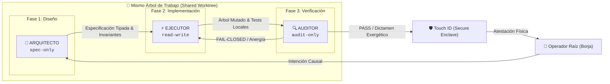

# Manifiesto Maestro de Habilidades C5-REAL (SKILLS.md)

> **Estándar:** Orquestación Declarativa mediante Directivas (`AGENTS.md` & `SKILLS.md`)  
> **Versión:** 26.210 · SOTA 2026  
> **Última Modificación:** 2026-10-01 17:35:14 UTC  
> **Ecosistema:** BABYLON-60 / CORTEX Engine / Apple Silicon M3 Pro Sovereign Node  
> **Total Habilidades Registradas:** 258 (133 Core Sovereign + 125 Plugins Especializados) (100% acopladas a la Tríada de Roles)

---

## 1. La Invariante de Orquestación Declarativa sobre el Mismo Árbol de Trabajo

En la arquitectura de sistemas agénticos avanzados (2026), el modelo monolítico («un solo agente que planifica, codifica, testea y se aprueba a sí mismo») queda formalmente vetado por generar auto-complacencia, alucinación acumulativa y anergía terminal (*Aforismo 3: La solución intentada es el problema*).

La orquestación declarativa gobierna la interacción de agentes especializados a través de contratos tipados explícitos operando sobre el **mismo árbol de trabajo (*shared worktree*)**:



### 1.1. Especificación de los Tres Roles Canónicos

| Rol | Modo de Acceso | Fase Causal | Misión Primaria | Veto Axiomático | Handoff |
| :--- | :--- | :--- | :--- | :--- | :--- |
| **`arquitecto`** | `spec-only` | `design` | Modelado formal, interfaces tipadas, contratos C5-REAL, topología MASS (Stage 1 / Stage 2) y especificación matemática. | Prohibido escribir código de producción ejecutable. | `operador` $\to$ `ejecutor` |
| **`ejecutor`** | `read-write` | `implementation` | Implementación física en silicio, mutación atómica de archivos, refactorizaciones, herramientas DevSecOps, DSP y compilaciones. | Prohibido alterar interfaces o relajar restricciones impuestas por el Arquitecto. | `arquitecto` $\to$ `auditor` |
| **`auditor`** | `audit-only` | `verification` | Verificación determinista independiente, linters estáticos/acústicos, oráculos SMT Z3, cota de Kolmogorov y cálculo de exergía (1-21.000). | Prohibido mutar código de producción o haber participado en la redacción del código. | `ejecutor` $\to$ `operador` |

---

## 2. Catálogo Declarativo de Habilidades por Rol

### 2.1. Cohorte de Arquitectura (`role: arquitecto` · 37 Skills)
*Habilidades de diseño conceptual, formulación de contratos, selección estratégica de problemas y modelado formal.*

| Skill | Tier | Categoría | Worktree | Allowed Roles | Descripción / Propósito |
| :--- | :---: | :--- | :---: | :---: | :--- |
| [`cortex-kernel`](skills/cortex-kernel/SKILL.md) | 23000 | Kernel | `spec-only` | `arquitecto` | CORTEX Root Kernel |
| [`shared-manifest-kernel`](skills/shared-manifest-kernel/SKILL.md) | 22000 | Kernel | `spec-only` | `arquitecto` | Núcleo de Memoria Compartida Lock-Free (64B C-ABI) |
| [`cortex-skill-composer`](skills/cortex-skill-composer/SKILL.md) | 21500 | Meta-Kernel | `spec-only` | `arquitecto, ejecutor` | Componedor & Orquestador de Cadenas de Skills |
| [`c5-enki-60`](skills/c5-enki-60/SKILL.md) | 21400 | Nucleus | `spec-only` | `arquitecto` | Motor Aritmético de Precisión Sexagesimal ENKI-60 |
| [`c5-information-thermodynamics`](skills/c5-information-thermodynamics/SKILL.md) | 21200 | Nucleus | `spec-only` | `arquitecto` | Termodinámica de la Información y Geometría Estadística |
| [`c5-scientific-problem-selection`](skills/c5-scientific-problem-selection/SKILL.md) | 21000 | Meta-Kernel | `spec-only` | `arquitecto` | Selección Estratégica de Problemas Científicos |
| [`cortex-skill-genesis`](skills/cortex-skill-genesis/SKILL.md) | 21000 | Meta-Kernel | `spec-only` | `arquitecto` | Génesis Autónoma de Skills CORTEX |
| [`c5-lean4-neurosymbolic-architect`](skills/c5-lean4-neurosymbolic-architect/SKILL.md) | 21000 | Nucleus | `spec-only` | `arquitecto` | Arquitecto Neuro-Simbólico Soberano en Lean 4 |
| [`epistemic-extinction-protocol`](skills/epistemic-extinction-protocol/SKILL.md) | 20980 | Nucleus | `spec-only` | `arquitecto` | Protocolo de Extinción Epistémica (Punto Fijo Ω) |
| [`cta-cognitive-transition-algebra`](skills/cta-cognitive-transition-algebra/SKILL.md) | 20950 | Nucleus | `spec-only` | `arquitecto` | Álgebra de Transiciones Cognitivas & Event-Sourcing Comonádico |
| [`c5-lean4-axiomatic-orchestrator`](skills/c5-lean4-axiomatic-orchestrator/SKILL.md) | 20900 | Nucleus | `spec-only` | `arquitecto` | Orquestador Axiomático y Verificación Formal en Lean 4 |
| [`agentic-protocol-axiomatization`](skills/agentic-protocol-axiomatization/SKILL.md) | 20800 | Nucleus | `spec-only` | `arquitecto` | Axiomatización de Protocolos Agénticos C5 & Generación DAC |
| [`c5-axiomatic-kernel`](skills/c5-axiomatic-kernel/SKILL.md) | 20500 | Nucleus | `spec-only` | `arquitecto` | c5-axiomatic-kernel |
| [`polymath-concept-synthesis`](skills/polymath-concept-synthesis/SKILL.md) | 20500 | Nucleus | `spec-only` | `arquitecto` | Síntesis Polímata Interdisciplinar (Modo ULTRATHINK) |
| [`c5-sci-paper-architect`](skills/c5-sci-paper-architect/SKILL.md) | 20400 | Nucleus | `spec-only` | `arquitecto` | Arquitecto de Publicaciones Científicas, Traducción & Citas SOTA |
| [`cct-cognitive-theory-advisor`](skills/cct-cognitive-theory-advisor/SKILL.md) | 20300 | Nucleus | `spec-only` | `arquitecto` | Asesoría en Teoría Cognitiva CCT & Límite Gödel-Turing |
| [`autodidact-omega-deep-research`](skills/autodidact-omega-deep-research/SKILL.md) | 20200 | Nucleus | `spec-only` | `arquitecto` | Motor Autodidact-Ω de Investigación Profunda y Falsación Popperiana |
| [`grill-me-v2`](skills/grill-me-v2/SKILL.md) | 19900 | Governance | `spec-only` | `arquitecto` | grill-me-v2 |
| [`wait-what`](skills/wait-what/SKILL.md) | 19600 | Nucleus | `spec-only` | `arquitecto` | Freno Epistémico & Traducción Simplificada (STE) |
| [`c5-sovereign-binary-architect`](skills/c5-sovereign-binary-architect/SKILL.md) | 19500 | Systems | `spec-only` | `arquitecto` | Arquitecto de Binarios Soberanos C5-REAL |
| [`symbiotic-cognitive-architecture`](skills/symbiotic-cognitive-architecture/SKILL.md) | 19400 | Governance | `spec-only` | `arquitecto` | Arquitectura Cognitiva Simbiótica & Autopoiesis (Tú & Yo) |
| [`c5-design-system-extractor`](skills/c5-design-system-extractor/SKILL.md) | 19200 | Governance | `spec-only` | `arquitecto` | Extractor de Sistemas de Diseño e Interfaz UI |
| [`c5-spatial-audio-architect`](skills/c5-spatial-audio-architect/SKILL.md) | 19000 | Multimedia & DSP | `spec-only` | `arquitecto` | c5-spatial-audio-architect |
| [`babylon60-architecture`](skills/babylon60-architecture/SKILL.md) | 19000 | Governance | `spec-only` | `arquitecto` | babylon60-architecture |
| [`c5-ctm-formal-architect`](skills/c5-ctm-formal-architect/SKILL.md) | 18500 | Specialized | `spec-only` | `arquitecto` | c5-ctm-formal-architect |
| [`c5-editorial-magazine-architect`](skills/c5-editorial-magazine-architect/SKILL.md) | 18500 | Specialized | `spec-only` | `arquitecto` | Arquitecto de Diseño Editorial, Revistas y Presentaciones |
| [`c5-equity-research`](skills/c5-equity-research/SKILL.md) | 18500 | Governance | `spec-only` | `arquitecto` | Investigación Financiera Institucional & Análisis Cuantitativo C5 |
| [`c5-ontological-translator`](skills/c5-ontological-translator/SKILL.md) | 18500 | Specialized | `spec-only` | `arquitecto` | c5-ontological-translator |
| [`c5-pedagogical-translator`](skills/c5-pedagogical-translator/SKILL.md) | 18500 | Specialized | `spec-only` | `arquitecto` | Traductor Pedagógico C5-REAL (Modo Fácil) |
| [`c5-solar-thermodynamic-architecture`](skills/c5-solar-thermodynamic-architecture/SKILL.md) | 18500 | Specialized | `spec-only` | `arquitecto` | Arquitectura Helio-Termodinámica y Confort Bioclimático |
| [`c5-systemic-dissection-protocol`](skills/c5-systemic-dissection-protocol/SKILL.md) | 18500 | Specialized | `spec-only` | `arquitecto` | Protocolo de Disección Sistémica y Termodinámica |
| [`c5-venture-pitch-architect`](skills/c5-venture-pitch-architect/SKILL.md) | 18200 | Governance | `spec-only` | `arquitecto` | Arquitecto de Pitch Decks, Deal Memos & Investor Relations C5 |
| [`c5-weighted-decision-matrix`](skills/c5-weighted-decision-matrix/SKILL.md) | 18200 | Governance | `spec-only` | `arquitecto` | Matriz de Decisión Ponderada y Estimación PERT |
| [`c5-career-and-interview-architect`](skills/c5-career-and-interview-architect/SKILL.md) | 17600 | Operations | `spec-only` | `arquitecto` | Arquitecto de CV, Compatibilidad ATS & Ensayos de Entrevista STAR C5 |
| [`c5-interactive-gantt-planner`](skills/c5-interactive-gantt-planner/SKILL.md) | 17500 | Operations | `spec-only` | `arquitecto` | Planificador Interactivo Gantt y Ruta Crítica |
| [`github-architect`](skills/github-architect/SKILL.md) | 17000 | Operations | `spec-only` | `arquitecto` | github-architect |
| [`writing-for-agents`](skills/writing-for-agents/SKILL.md) | 16500 | Utilities | `spec-only` | `arquitecto` | Redacción M2M de Alta Exergía & Sanitización C5 |

### 2.2. Cohorte de Ejecución (`role: ejecutor` · 44 Skills)
*Habilidades de mutación del árbol de trabajo, transductores de silicio, generación de código, audio/vídeo DSP y DevSecOps.*

| Skill | Tier | Categoría | Worktree | Allowed Roles | Descripción / Propósito |
| :--- | :---: | :--- | :---: | :---: | :--- |
| [`c5-sovereign-system1-engine`](skills/c5-sovereign-system1-engine/SKILL.md) | 20850 | Nucleus | `read-write` | `ejecutor` | Motor de Decisión Sistema 1 No Autorregresivo (LAYA Edge) |
| [`c5-sharur-3600`](skills/c5-sharur-3600/SKILL.md) | 20600 | Governance | `read-write` | `ejecutor` | Matriz de Enjambre Sexagesimal SHARUR-3600 (Legión 100 Agentes) |
| [`c5-epistemic-dissemination-engine`](skills/c5-epistemic-dissemination-engine/SKILL.md) | 20500 | Nucleus | `read-write` | `ejecutor` | Motor de Difusión Epistémica Multicanal y Oratoria Retórica |
| [`c5-1password-secrets`](skills/c5-1password-secrets/SKILL.md) | 20500 | Governance | `read-write` | `ejecutor` | Inyección Segura de Credenciales en Silicio (1Password CLI / Touch ID) |
| [`c5-session-deskimming`](skills/c5-session-deskimming/SKILL.md) | 20250 | Governance | `read-write` | `ejecutor` | Protocolo de Desnatado de Sesiones & Purga de Nata (Ring-2 -> Ring-0) |
| [`c5-tamkarum-60`](skills/c5-tamkarum-60/SKILL.md) | 20100 | Governance | `read-write` | `ejecutor` | Transductor de Arbitraje Soberano TAMKARUM-60 (Ring-1) |
| [`c5-metodo-acreativo`](skills/c5-metodo-acreativo/SKILL.md) | 20050 | Nucleus | `read-write` | `ejecutor` | Método Acreativo Soberano (Transducción de Invariantes & Aforismo 5) |
| [`c5-real-devsecops-scaffold`](skills/c5-real-devsecops-scaffold/SKILL.md) | 19850 | Governance | `read-write` | `ejecutor` | Scaffold DevSecOps & Endurecimiento Zero-Trust CI/CD |
| [`apple-bypass`](skills/apple-bypass/SKILL.md) | 19800 | Operations | `read-write` | `ejecutor` | apple-bypass |
| [`c5-continual-memory`](skills/c5-continual-memory/SKILL.md) | 19650 | Governance | `read-write` | `ejecutor` | Motor de Memoria Continua y Persistencia Episódica |
| [`adaptive-cron`](skills/adaptive-cron/SKILL.md) | 19500 | Governance | `read-write` | `ejecutor` | adaptive-cron |
| [`c5-sovereign-daemon-deployment`](skills/c5-sovereign-daemon-deployment/SKILL.md) | 19350 | Operations | `read-write` | `ejecutor` | Despliegue Determinista de Daemons Soberanos (macOS launchd) |
| [`c5-socint-extraction-suite`](skills/c5-socint-extraction-suite/SKILL.md) | 19200 | SOCINT & Web | `read-write` | `ejecutor` | Suite Soberana de Inteligencia Social (SOCINT C5-REAL) |
| [`safari-browser-agent`](skills/safari-browser-agent/SKILL.md) | 19200 | SOCINT & Web | `read-write` | `ejecutor` | Agente Autónomo de Navegación Safari (MCP Dual-Engine v6.0 Sexagesimal Apex Sovereign) |
| [`swarm-quantum-collapse`](skills/swarm-quantum-collapse/SKILL.md) | 19100 | Governance | `read-write` | `ejecutor` | Sincronización Swarm & Colapso Cuántico Multi-Repositorio |
| [`c5-personal-ops-hub`](skills/c5-personal-ops-hub/SKILL.md) | 19100 | Governance | `read-write` | `ejecutor` | Cortafuegos de Triage Burocrático y Operaciones Personales (Tradbot) |
| [`pika-generative-video-pipeline`](skills/pika-generative-video-pipeline/SKILL.md) | 19000 | Multimedia & DSP | `read-write` | `ejecutor` | Pipeline de Generación y Control Parámetrico en Pika Art (A/V) |
| [`remotion-audio-reactive-video`](skills/remotion-audio-reactive-video/SKILL.md) | 19000 | Multimedia & DSP | `read-write` | `ejecutor` | Síntesis de Vídeo Reactivo a Audio & Música (Remotion + DSP) |
| [`soulseek-p2p-audio-acquisition`](skills/soulseek-p2p-audio-acquisition/SKILL.md) | 19000 | Multimedia & DSP | `read-write` | `ejecutor` | soulseek-p2p-audio-acquisition |
| [`c5-alpha-extraction-pipeline`](skills/c5-alpha-extraction-pipeline/SKILL.md) | 18950 | Operations | `read-write` | `ejecutor` | Pipeline de Extracción de Alfa & Arbitraje Asimétrico |
| [`whatsapp-nexus-protocol`](skills/whatsapp-nexus-protocol/SKILL.md) | 18900 | Governance | `read-write` | `ejecutor` | Pasarela Soberana de Mensajería WhatsApp (Baileys v7 / Rust NAPI-RS / C5-REAL v2.6) |
| [`dynamic-subagent-lifecycle`](skills/dynamic-subagent-lifecycle/SKILL.md) | 18600 | Governance | `read-write` | `ejecutor, arquitecto` | Supervisión del Ciclo de Vida de Subagentes Dinámicos |
| [`c5-gemini-api-2026-standards`](skills/c5-gemini-api-2026-standards/SKILL.md) | 18500 | Specialized | `read-write` | `ejecutor` | Estándares Gemini API 2026 & Tensor de Transducción |
| [`c5-media-platform-epistemology`](skills/c5-media-platform-epistemology/SKILL.md) | 18500 | Specialized | `read-write` | `ejecutor` | c5-media-platform-epistemology |
| [`c5-overheard-radar`](skills/c5-overheard-radar/SKILL.md) | 18300 | Governance | `read-write` | `ejecutor` | Radar Soberano de Escucha Social y Tendencias (Reddit / Hacker News) |
| [`browser-subagent-orchestrator`](skills/browser-subagent-orchestrator/SKILL.md) | 18200 | Governance | `read-write` | `ejecutor` | Orquestador CDP de Subagente de Navegador Web |
| [`lora-swarm-pipeline`](skills/lora-swarm-pipeline/SKILL.md) | 18200 | Operations | `read-write` | `ejecutor` | lora-swarm-pipeline |
| [`f5tts-voice-cloning-sota`](skills/f5tts-voice-cloning-sota/SKILL.md) | 18200 | Operations | `read-write` | `ejecutor` | Clonación Vocal Neuronal SOTA (F5-TTS / MPS / Ingeniería de Prosodia) |
| [`swarm-router`](skills/swarm-router/SKILL.md) | 18100 | Governance | `read-write` | `ejecutor, arquitecto` | Enrutador Maestro y Despachador Inteligente de Enjambres |
| [`somatic-ble-transduction`](skills/somatic-ble-transduction/SKILL.md) | 18100 | Operations | `read-write` | `ejecutor` | Transductor Telemétrico Somático BLE (Apple Watch Ring-(-3)) |
| [`c5-forensic-socint-pipeline`](skills/c5-forensic-socint-pipeline/SKILL.md) | 17950 | Operations | `read-write` | `ejecutor` | Pipeline Forense SOCINT & Bifurcación Epistémica |
| [`c5-spaced-repetition-architect`](skills/c5-spaced-repetition-architect/SKILL.md) | 17800 | Operations | `read-write` | `ejecutor` | Arquitecto de Repetición Espaciada, Anki & Control Entrópico Cognitivo C5 |
| [`jujutsu-vcs-management`](skills/jujutsu-vcs-management/SKILL.md) | 17600 | Operations | `read-write` | `ejecutor` | Control de Versiones Determinista Jujutsu VCS (jj) |
| [`c5-neural-face-swap-cuadrilla`](skills/c5-neural-face-swap-cuadrilla/SKILL.md) | 17400 | Operations | `read-write` | `ejecutor` | Pipeline Neural Face-Swap Cuadrilla (InsightFace CoreML) |
| [`homebrew-ecosystem-management`](skills/homebrew-ecosystem-management/SKILL.md) | 17200 | Operations | `read-write` | `ejecutor` | Gestión & Auditoría de Paquetes Homebrew en macOS |
| [`wizard`](skills/wizard/SKILL.md) | 17000 | Utilities | `read-write` | `ejecutor` | Asistente Secuencial Determinista (Máquina de Estados) |
| [`flstudio-mcp-production`](skills/flstudio-mcp-production/SKILL.md) | 17000 | Operations | `read-write` | `ejecutor` | Producción Nativa MCP FL Studio 2025 & DSP Microtonal |
| [`c5-macos-visual-calibration`](skills/c5-macos-visual-calibration/SKILL.md) | 16900 | Diagnostics | `read-write` | `ejecutor` | Calibración Visual y Accesibilidad macOS (UniversalAccess Purge) |
| [`youtube-remotion-sota`](skills/youtube-remotion-sota/SKILL.md) | 16800 | Operations | `read-write` | `ejecutor` | Síntesis Programática SOTA de Vídeo React/Remotion |
| [`audiovisual-sota`](skills/audiovisual-sota/SKILL.md) | 16800 | Operations | `read-write` | `ejecutor` | audiovisual-sota |
| [`djstudio-mcp`](skills/djstudio-mcp/SKILL.md) | 16200 | Operations | `read-write` | `ejecutor` | Controlador DSP & Playlist Mixer DJ.Studio MCP |
| [`kimi-mcp-orchestrator`](skills/kimi-mcp-orchestrator/SKILL.md) | 16000 | Operations | `read-write` | `ejecutor` | kimi-mcp-orchestrator |
| [`cloudflare-mcp-usage`](skills/cloudflare-mcp-usage/SKILL.md) | 15800 | Operations | `read-write` | `ejecutor` | Automatización & Operaciones Cloudflare MCP |
| [`suno-bracket-tagging`](skills/suno-bracket-tagging/SKILL.md) | 12800 | Utilities | `read-write` | `ejecutor` | Protocolo de Ingeniería Acústica y Control Causal para Audio AI (Suno/Udio/YuE) |

### 2.3. Cohorte de Auditoría (`role: auditor` · 52 Skills)
*Habilidades de verificación fail-closed, linters acústicos/estáticos, oráculos SMT Z3, postmortems y cálculo de exergía.*

| Skill | Tier | Categoría | Worktree | Allowed Roles | Descripción / Propósito |
| :--- | :---: | :--- | :---: | :---: | :--- |
| [`c5-kudurru-64`](skills/c5-kudurru-64/SKILL.md) | 22500 | Kernel | `audit-only` | `auditor, arquitecto` | Cerrojo Lock-Free KUDURRU-64 (Ring-0 Gravity Filter) |
| [`c5-mushushu-0`](skills/c5-mushushu-0/SKILL.md) | 22000 | Kernel | `audit-only` | `auditor` | Oráculo Formal & Firewall de Apoptosis MUSHUSHU-0 (Ring-0) |
| [`c5-larsa-120`](skills/c5-larsa-120/SKILL.md) | 21800 | Kernel | `audit-only` | `auditor, arquitecto` | Consenso BFT Isostático LARSA-120 (Tríada Rust/Lean4/Z3) |
| [`thermo-audit`](skills/thermo-audit/SKILL.md) | 21500 | Kernel | `audit-only` | `auditor` | Auditoría Termodinámica de Silicio y Concurrencia |
| [`c5-thermos-audit`](skills/c5-thermos-audit/SKILL.md) | 21400 | Kernel | `audit-only` | `auditor` | Auditoría Termonuclear de Silicio & Código (Double Thermo) |
| [`cortex-skill-auditor`](skills/cortex-skill-auditor/SKILL.md) | 21200 | Meta-Kernel | `audit-only` | `auditor, arquitecto` | Auditor Exergético de Skills CORTEX Engine |
| [`rlhf-sentinel`](skills/rlhf-sentinel/SKILL.md) | 21200 | Governance | `audit-only` | `auditor` | Centinela de Contención de IA y Barreras IPC Ring-0 |
| [`c5-mitxu-oracle`](skills/c5-mitxu-oracle/SKILL.md) | 21000 | Nucleus | `audit-only` | `auditor` | Oráculo de Aforismo 5 Mitxu (Auditoría de Coste Involuntario) |
| [`c5-oncologist`](skills/c5-oncologist/SKILL.md) | 20950 | Nucleus | `audit-only` | `auditor` | Oncólogo Termodinámico (Detección de Metástasis Topológica) |
| [`c5-silicon-stress-suite`](skills/c5-silicon-stress-suite/SKILL.md) | 20850 | Operations | `audit-only` | `auditor` | Suite de Estrés Concurrente de Silicio y Enjambres (C5-REAL) |
| [`categorical-hallucination-audit`](skills/categorical-hallucination-audit/SKILL.md) | 20700 | Nucleus | `audit-only` | `auditor` | Auditoría Categórica de Alucinación & Cota Kl(D) |
| [`c5-notario-epistemico`](skills/c5-notario-epistemico/SKILL.md) | 20700 | Nucleus | `audit-only` | `auditor` | Notario Epistémico de Silicio (MUSHUSHU-NOTARY / Primitiva P1) |
| [`existence-gap-audit`](skills/existence-gap-audit/SKILL.md) | 20600 | Nucleus | `audit-only` | `auditor` | Auditoría de Huecos de Existencia & Supply-Chain Slop |
| [`c5-academic-peer-reviewer`](skills/c5-academic-peer-reviewer/SKILL.md) | 20500 | Nucleus | `audit-only` | `auditor` | Simulador de Revisión Académica por Pares |
| [`c5-dialectical-pipeline`](skills/c5-dialectical-pipeline/SKILL.md) | 20500 | Nucleus | `audit-only` | `auditor, arquitecto` | c5-dialectical-pipeline |
| [`c5-popperian-falsification-auditor`](skills/c5-popperian-falsification-auditor/SKILL.md) | 20500 | Nucleus | `audit-only` | `auditor` | Auditor de Falsación Empírica de Documentos |
| [`c5-rubin-acoustic-linter`](skills/c5-rubin-acoustic-linter/SKILL.md) | 20450 | Operations | `audit-only` | `auditor` | Linter Acústico de Exergía y Purga de Nata (Protocolo Rubin) |
| [`c5-ultrathink-epistemic-audit`](skills/c5-ultrathink-epistemic-audit/SKILL.md) | 20400 | Nucleus | `audit-only` | `auditor` | Auditoría Epistémica y Postmortem ULTRATHINK |
| [`c5-real-thermodynamic-override`](skills/c5-real-thermodynamic-override/SKILL.md) | 20400 | Governance | `audit-only` | `auditor` | Override Termodinámico & Prompt Engineering de Frontera |
| [`c5-sandbox-auditor`](skills/c5-sandbox-auditor/SKILL.md) | 20350 | Governance | `audit-only` | `auditor` | Auditor Sistémico de Confinamiento & Sandboxing (KUDURRU Gate) |
| [`cloud-chamber`](skills/cloud-chamber/SKILL.md) | 20200 | Nucleus | `audit-only` | `auditor` | Cámara de Niebla y Síntesis de Máxima Densidad Topológica |
| [`c5-wetware-divergente`](skills/c5-wetware-divergente/SKILL.md) | 19850 | Governance | `audit-only` | `auditor` | Arquitectura Cognitiva para Wetware Divergente (Perfiles 2e) |
| [`c5-sovereign-identity-hardening`](skills/c5-sovereign-identity-hardening/SKILL.md) | 19800 | Governance | `audit-only` | `auditor` | Protocolo C5-REAL de Defensa e Inmunidad de Identidad Soberana |
| [`c5-2e-affective-decoupling`](skills/c5-2e-affective-decoupling/SKILL.md) | 19800 | Nucleus | `audit-only` | `auditor` | Desacoplamiento Afectivo & Soberanía Vincular 2e (AACC + TDAH) |
| [`c5-real-legaltech-analysis`](skills/c5-real-legaltech-analysis/SKILL.md) | 19700 | Governance | `audit-only` | `auditor` | Auditoría LegalTech & Cumplimiento EU AI Act Art. 9-14 |
| [`c5-2e-neuropharmacological-sovereignty`](skills/c5-2e-neuropharmacological-sovereignty/SKILL.md) | 19500 | Systems | `audit-only` | `auditor` | Soberanía Neurofarmacológica & Desacople de Parches (TDAH + AACC) |
| [`c5-sre-postmortem-architect`](skills/c5-sre-postmortem-architect/SKILL.md) | 19500 | Governance | `audit-only` | `auditor` | Arquitecto de Postmortems e Incidentes SRE |
| [`anergy-purge-protocol`](skills/anergy-purge-protocol/SKILL.md) | 19300 | Governance | `audit-only` | `auditor` | Motor de Purga de Código Muerto y Redundancias (Dead Code & Artifact Cleanup) |
| [`c5-browser-forensics-and-extension-triage`](skills/c5-browser-forensics-and-extension-triage/SKILL.md) | 19200 | SOCINT & Web | `audit-only` | `auditor` | c5-browser-forensics-and-extension-triage |
| [`ai-comparative-evaluation`](skills/ai-comparative-evaluation/SKILL.md) | 19200 | Operations | `audit-only` | `auditor` | ai-comparative-evaluation |
| [`c5-video-quality-audit`](skills/c5-video-quality-audit/SKILL.md) | 19000 | Multimedia & DSP | `audit-only` | `auditor` | Auditoría de Calidad y Compresión de Video (PSNR/SSIM/VMAF) |
| [`c5-barrio-termodinamico-persona`](skills/c5-barrio-termodinamico-persona/SKILL.md) | 18500 | Specialized | `audit-only` | `auditor` | c5-barrio-termodinamico-persona |
| [`c5-causal-graph-auditor`](skills/c5-causal-graph-auditor/SKILL.md) | 18500 | Specialized | `audit-only` | `auditor, arquitecto` | Auditor de Grafos Causales C5-REAL (Mermaid) |
| [`c5-codebase-valuation-audit`](skills/c5-codebase-valuation-audit/SKILL.md) | 18500 | Specialized | `audit-only` | `auditor` | Auditoría & Valoración Económica Empírica de Codebases e IP |
| [`c5-exergy-scale-evaluator`](skills/c5-exergy-scale-evaluator/SKILL.md) | 18500 | Specialized | `audit-only` | `auditor` | c5-exergy-scale-evaluator |
| [`c5-somatic-panic-deescalation`](skills/c5-somatic-panic-deescalation/SKILL.md) | 18500 | Specialized | `audit-only` | `auditor` | c5-somatic-panic-deescalation |
| [`webkit-memory-audit`](skills/webkit-memory-audit/SKILL.md) | 18500 | Specialized | `audit-only` | `auditor` | Auditoría de Memoria WebKit (Vector 21) |
| [`biographical-thermo`](skills/biographical-thermo/SKILL.md) | 18500 | Nucleus | `audit-only` | `auditor` | Mapeo Termodinámico Biográfico e Histórico |
| [`babylon-shield`](skills/babylon-shield/SKILL.md) | 18500 | Specialized | `audit-only` | `auditor, arquitecto` | Escudo Termodinámico Ring-0 (Caballo de Troya BABYLON-SHIELD) |
| [`discourse-popperian-falsification`](skills/discourse-popperian-falsification/SKILL.md) | 17900 | Operations | `audit-only` | `auditor` | Falsación Popperiana & Auditoría Discursiva de Hipótesis |
| [`ghidra-ida-binary-audit`](skills/ghidra-ida-binary-audit/SKILL.md) | 17800 | Operations | `audit-only` | `auditor` | Auditoría de Binarios Crudos & Descompilación Ghidra/IDA |
| [`electron-asar-forensic-audit`](skills/electron-asar-forensic-audit/SKILL.md) | 17700 | Operations | `audit-only` | `auditor` | electron-asar-forensic-audit |
| [`c5-lexicon-enforcer`](skills/c5-lexicon-enforcer/SKILL.md) | 17500 | Operations | `audit-only` | `auditor` | c5-lexicon-enforcer |
| [`cortex-telemetry`](skills/cortex-telemetry/SKILL.md) | 17500 | Operations | `audit-only` | `auditor` | Inspección & Telemetría Runtime de Transcripciones CORTEX |
| [`c5-comment-sicko`](skills/c5-comment-sicko/SKILL.md) | 16500 | Utilities | `audit-only` | `auditor` | Purgador Acreativo de Comentarios & Sermones (Comment Sicko) |
| [`youtube-analysis-pipeline`](skills/youtube-analysis-pipeline/SKILL.md) | 16400 | Operations | `audit-only` | `auditor` | Pipeline de Análisis Visual & Transcripción de YouTube |
| [`opentimestamps-l5-diagnostics`](skills/opentimestamps-l5-diagnostics/SKILL.md) | 15000 | Diagnostics | `audit-only` | `auditor` | Atestación Criptográfica & Diagnóstico Bitcoin L5 (OpenTimestamps) |
| [`electron-mac-bundle-collision-diagnostics`](skills/electron-mac-bundle-collision-diagnostics/SKILL.md) | 14800 | Diagnostics | `audit-only` | `auditor` | Diagnóstico de Crashes & Colisiones Electron en macOS |
| [`vscode-git-packed-refs-diagnostics`](skills/vscode-git-packed-refs-diagnostics/SKILL.md) | 14600 | Diagnostics | `audit-only` | `auditor` | Reparación de Corruptelas Git & Packed-Refs en VS Code |
| [`macos-lulu-firewall-diagnostics`](skills/macos-lulu-firewall-diagnostics/SKILL.md) | 14200 | Diagnostics | `audit-only` | `auditor` | Diagnóstico de Firewall & Sockets macOS (LuLu / Little Snitch) |
| [`github-api-rate-limit-optimization`](skills/github-api-rate-limit-optimization/SKILL.md) | 13900 | Utilities | `audit-only` | `auditor` | Optimización Resiliente de Tasa API GitHub (Error 429) |
| [`handoff`](skills/handoff/SKILL.md) | 10500 | Utilities | `audit-only` | `auditor, arquitecto, ejecutor` | Protocolo Soberano de Traspaso de Contexto C5-REAL |

---

## 3. Protocolo Funtorial de Colaboración en Cadenas Complejas

Cuando una tarea requiere la orquestación coordinada de múltiples habilidades, el pipeline se estructura de forma funtorial asegurando que cada paso respete la tríada de roles:

### Pipeline 1: Ingeniería de Software Crítico & Criptografía (Kernel / Rust / Lean 4)
1. **Fase de Diseño (`arquitecto`):** `c5-lean4-neurosymbolic-architect` $\to$ `agentic-protocol-axiomatization`. Define tipos, teoremas y especificación formal.
2. **Fase de Implementación (`ejecutor`):** `c5-real-devsecops-scaffold` $\to$ `jujutsu-vcs-management`. Escribe el código en el árbol de trabajo y compila.
3. **Fase de Auditoría (`auditor`):** `c5-thermos-audit` $\to$ `c5-mushushu-0` $\to$ `c5-kudurru-64`. Tritura la rama, audita memoria L1 y valida invariantes formales sin participar en la escritura.

### Pipeline 2: Producción Musical y Síntesis Acústica de Alta Exergía
1. **Fase de Diseño (`arquitecto`):** `c5-spatial-audio-architect` $\to$ `c5-enki-60`. Diseña la microtonalidad, disposición binaural y matrices de mezcla.
2. **Fase de Implementación (`ejecutor`):** `flstudio-mcp-production` $\to$ `f5tts-voice-cloning-sota` $\to$ `remotion-audio-reactive-video`. Genera patrones MIDI, sintetiza audio y compila stems.
3. **Fase de Auditoría (`auditor`):** `c5-rubin-acoustic-linter`. Audita WCF $\ge 12\text{ dB}$, SFM $< 0.15$ y coherencia LPC $\ge 0.95$. Si detecta nata o compresión destructiva, rechaza (*fail-closed*).

### Pipeline 3: Investigación Científica, Ontológica y Publicación
1. **Fase de Diseño (`arquitecto`):** `c5-scientific-problem-selection` $\to$ `autodidact-omega-deep-research` $\to$ `polymath-concept-synthesis`.
2. **Fase de Implementación (`ejecutor`):** `c5-epistemic-dissemination-engine` $\to$ `c5-continual-memory`. Redacta el paper/artículo y estructura los datasets.
3. **Fase de Auditoría (`auditor`):** `c5-popperian-falsification-auditor` $\to$ `c5-academic-peer-reviewer` $\to$ `c5-exergy-scale-evaluator`. Dictamina falsabilidad empírica y califica en escala 1-21.000.

---

## 4. Invariante de Atestación Biométrica Final (Ring-0 Gate)
Ningún artefacto generado por el **Ejecutor** y aprobado por el **Auditor** puede ser desplegado a producción, commiteado a ramas protegidas o enviado a redes externas sin el contacto dactilar físico del **Operador Raíz (Borja)** en el sensor Touch ID del Secure Enclave:

```bash
c5_biometric_gate --causal-hash <sha256> --action "Deploy / Merge" --agent "Auditor" --scope "Ring-0"
```


---

## 3. Catálogo de Habilidades de Plugins Especializados (125 Skills)

Estas habilidades provienen de los plugins integrados en `plugins/` (Science, Flutter, Firebase, Data Agent Kit, Chrome DevTools, Gemini API, etc.) y se subordinan estrictamente a la Tríada Canónica de Roles:

### 3.1. Plugins de Arquitectura (`role: arquitecto` · 8 Skills)
| Skill | Plugin | Modo Worktree | Descripción |
| :--- | :--- | :---: | :--- |
| [`dart-build-cli-app`](plugins/flutter/skills/dart-build-cli-app/SKILL.md) | `flutter` | `spec-only` | Entrypoint structure, exit codes, cross-platform scripts. Use when building command line utilities, ... |
| [`dart-write-documentation`](plugins/flutter/skills/dart-write-documentation/SKILL.md) | `flutter` | `spec-only` | Rules and formatting guidelines for writing Dart /// API documentation and doc comments. Use when do... |
| [`flutter-apply-architecture-best-practices`](plugins/flutter/skills/flutter-apply-architecture-best-practices/SKILL.md) | `flutter` | `spec-only` | Architects a Flutter application using the recommended layered approach (UI, Logic, Data). Use when ... |
| [`flutter-setup-declarative-routing`](plugins/flutter/skills/flutter-setup-declarative-routing/SKILL.md) | `flutter` | `spec-only` | Configure `MaterialApp.router` using a package like `go_router` for advanced URL-based navigation. U... |
| [`flutter-setup-localization`](plugins/flutter/skills/flutter-setup-localization/SKILL.md) | `flutter` | `spec-only` | Add `flutter_localizations` and `intl` dependencies, enable "generate true" in `pubspec.yaml`, and c... |
| [`google-antigravity-sdk`](plugins/google-antigravity-sdk/skills/google-antigravity-sdk/SKILL.md) | `google-antigravity-sdk` | `spec-only` | Design, implement, and debug autonomous AI agents and multi-agent systems using the Google Antigravi... |
| [`modern-web-guidance`](plugins/modern-web-guidance-plugin/skills/modern-web-guidance/SKILL.md) | `modern-web-guidance-plugin` | `spec-only` | Search tool for modern web development best practices. MANDATORY: Execute FIRST for all HTML/CSS and... |
| [`predictingthepast`](plugins/science/skills/predictingthepast/SKILL.md) | `science` | `spec-only` | Ancient text restoration, attribution, dating, contextualization, and embedding via Aeneas (Latin) /... |

### 3.2. Plugins de Ejecución (`role: ejecutor` · 103 Skills)
| Skill | Plugin | Modo Worktree | Descripción |
| :--- | :--- | :---: | :--- |
| [`accidental-data-loss-prevention`](plugins/data-agent-kit-plugin/skills/accidental_data_loss_prevention/SKILL.md) | `data-agent-kit-plugin` | `read-write` | **STOP AND VERIFY**: Before running any command or tool that results in irreversible data loss, you ... |
| [`alphafold-database-fetch-and-analyze`](plugins/science/skills/alphafold_database_fetch_and_analyze/SKILL.md) | `science` | `read-write` | Retrieve and analyze AlphaFold predicted structures for a protein. Use when the user provides a spec... |
| [`alphagenome-atlas-website-links`](plugins/science/skills/alphagenome_atlas_website_links/SKILL.md) | `science` | `read-write` | Constructs deep-links and URLs for the AlphaGenome Atlas website. Supports generating single-variant... |
| [`alphagenome-single-variant-analysis`](plugins/science/skills/alphagenome_single_variant_analysis/SKILL.md) | `science` | `read-write` | Analyzes genetic variant effects on gene expression (RNA-seq), chromatin accessibility (DNASE), hist... |
| [`alphagenome-variant-impact-score`](plugins/science/skills/alphagenome_variant_impact_score/SKILL.md) | `science` | `read-write` | Score, annotate, and analyze the functional impact of genetic variants using AlphaGenome Variant Imp... |
| [`android-cli`](plugins/android-cli-plugin/skills/SKILL.md) | `android-cli-plugin` | `read-write` | Provides instructions for installing and using the `android` CLI. The `android` command-line tool is... |
| [`babylon60-ide-orchestrator`](plugins/babylon60-ide/skills/babylon60-ide-orchestrator/SKILL.md) | `babylon60-ide` | `read-write` | Orquestación de la INTERFAZ y telemetría del IDE BABYLON-60. Keywords: interfaz babylon, orquestar i... |
| [`bigquery-ai-ml`](plugins/data-agent-kit-plugin/skills/bigquery_ai_ml/SKILL.md) | `data-agent-kit-plugin` | `read-write` | Leverages BigQuery's built-in machine learning and GenAI capabilities for advanced data analytics. U... |
| [`bigquery-bigframes`](plugins/data-agent-kit-plugin/skills/bigquery_bigframes/SKILL.md) | `data-agent-kit-plugin` | `read-write` | Generates Python code using BigQuery DataFrames (BigFrames), the pandas/scikit-learn-style API over ... |
| [`bigquery-data-transfer-service`](plugins/data-agent-kit-plugin/skills/bigquery_data_transfer_service/SKILL.md) | `data-agent-kit-plugin` | `read-write` | Discovers and inspects BigQuery Data Transfer Service (DTS) configurations. Use this to identify exi... |
| [`bigquery-graph`](plugins/data-agent-kit-plugin/skills/bigquery_graph/SKILL.md) | `data-agent-kit-plugin` | `read-write` | Provides guidelines and best practices for querying and defining property graphs and semantic graphs... |
| [`bigquery-sql`](plugins/data-agent-kit-plugin/skills/bigquery_sql/SKILL.md) | `data-agent-kit-plugin` | `read-write` | Provides BigQuery SQL query optimization techniques, execution best practices, and performance tunin... |
| [`bigtable-basics`](plugins/data-agent-kit-plugin/skills/bigtable_basics/SKILL.md) | `data-agent-kit-plugin` | `read-write` | Assists in provisioning instances/tables, designing performant schemas, and querying data in Bigtabl... |
| [`building-data-apps`](plugins/data-agent-kit-plugin/skills/building_data_apps/SKILL.md) | `data-agent-kit-plugin` | `read-write` | Build modern data apps, dashboards, and interactive reports using either React + Vite or Streamlit. ... |
| [`chembl-database`](plugins/science/skills/chembl_database/SKILL.md) | `science` | `read-write` | Query the ChEMBL database for bioactive molecules, drug targets, bioactivity data, approved drugs, a... |
| [`chrome-devtools`](plugins/chrome-devtools-plugin/skills/chrome-devtools/SKILL.md) | `chrome-devtools-plugin` | `read-write` | Uses Chrome DevTools via MCP for efficient debugging, troubleshooting and browser automation. Use wh... |
| [`chrome-extensions`](plugins/modern-web-guidance-plugin/skills/chrome-extensions/SKILL.md) | `modern-web-guidance-plugin` | `read-write` | Build and publish Chrome Extensions using Manifest V3 best practices. Use this skill whenever the us... |
| [`clinical-trials-database`](plugins/science/skills/clinical_trials_database/SKILL.md) | `science` | `read-write` | Query ClinicalTrials.gov via APIv2. Use when you want to search for trials by condition, drug, locat... |
| [`clinvar-database`](plugins/science/skills/clinvar_database/SKILL.md) | `science` | `read-write` | Use when needing clinical significance, pathogenicity classifications (e.g., Pathogenic, Benign, VUS... |
| [`dart-generate-test-mocks`](plugins/flutter/skills/dart-generate-test-mocks/SKILL.md) | `flutter` | `read-write` | Define and generate mock objects for external dependencies using `package:mockito` and `build_runner... |
| [`dart-setup-ffi-assets`](plugins/flutter/skills/dart-setup-ffi-assets/SKILL.md) | `flutter` | `read-write` | Guides agents in compiling and packaging C/C++ source code into dynamic or static libraries (Code As... |
| [`dart-use-ffigen`](plugins/flutter/skills/dart-use-ffigen/SKILL.md) | `flutter` | `read-write` | Guide agents to use `package:ffigen` to automatically generate FFI bindings instead of writing them ... |
| [`dart-use-pattern-matching`](plugins/flutter/skills/dart-use-pattern-matching/SKILL.md) | `flutter` | `read-write` | Use switch expressions and pattern matching where appropriate |
| [`dart-use-primary-constructors`](plugins/flutter/skills/dart-use-primary-constructors/SKILL.md) | `flutter` | `read-write` | Help users write syntactically and semantically correct primary constructors in Dart, and migrate/us... |
| [`data-autocleaning`](plugins/data-agent-kit-plugin/skills/data_autocleaning/SKILL.md) | `data-agent-kit-plugin` | `read-write` | Automated data quality and transformation capabilities for Dataform/dbt/BigQuery pipelines. Processe... |
| [`dataform-bigquery`](plugins/data-agent-kit-plugin/skills/dataform_bigquery/SKILL.md) | `data-agent-kit-plugin` | `read-write` | Expertise in generating clean, correct, and efficient Dataform pipeline code for BigQuery ELT. Use t... |
| [`dbsnp-database`](plugins/science/skills/dbsnp_database/SKILL.md) | `science` | `read-write` | Use when you want to look up, map, and search for short genetic variants (SNPs, indels) in NCBI's db... |
| [`dbt-bigquery`](plugins/data-agent-kit-plugin/skills/dbt_bigquery/SKILL.md) | `data-agent-kit-plugin` | `read-write` | Expert guidance for creating, modifying, and optimizing dbt pipelines for BigQuery. Use this skill w... |
| [`discovering-gcp-data-assets`](plugins/data-agent-kit-plugin/skills/discovering_gcp_data_assets/SKILL.md) | `data-agent-kit-plugin` | `read-write` | Finds and inspects data assets within Google Cloud. Relevant when any of the following conditions ar... |
| [`embl-ebi-ols`](plugins/science/skills/embl_ebi_ols/SKILL.md) | `science` | `read-write` | Query and search the EMBL-EBI Ontology Lookup Service (OLS) for biomedical ontology terms, definitio... |
| [`encode-ccres-database`](plugins/science/skills/encode_ccres_database/SKILL.md) | `science` | `read-write` | Query the ENCODE Registry of cis-Regulatory Elements (cCREs) via the SCREEN GraphQL API, or make cus... |
| [`enforcing-resource-attribution`](plugins/data-agent-kit-plugin/skills/enforcing_resource_attribution/SKILL.md) | `data-agent-kit-plugin` | `read-write` | Enforces resource attribution for CLI commands. Use this skill whenever you are running `bq` or `gcl... |
| [`ensembl-database`](plugins/science/skills/ensembl_database/SKILL.md) | `science` | `read-write` | Query the Ensembl database to resolve gene, transcript, and protein IDs, fetch genomic or protein se... |
| [`extension-to-functions-codebase`](plugins/firebase/skills/extension_to_functions_codebase/SKILL.md) | `firebase` | `read-write` | Skill for converting an installed Firebase Extension (or extension source) into a standalone Cloud F... |
| [`federate-lakehouse-catalog`](plugins/data-agent-kit-plugin/skills/federate_lakehouse_catalog/SKILL.md) | `data-agent-kit-plugin` | `read-write` | Sets up Google Cloud Lakehouse federated catalogs to remote Iceberg REST Catalogs. Currently support... |
| [`firebase-ai-logic-basics`](plugins/firebase/skills/firebase_ai_logic_basics/SKILL.md) | `firebase` | `read-write` | Official skill for integrating Firebase AI Logic (Gemini API) into web applications. Covers setup, m... |
| [`firebase-app-hosting-basics`](plugins/firebase/skills/firebase_app_hosting_basics/SKILL.md) | `firebase` | `read-write` | Deploys and manages full-stack web applications (Next.js, Angular) with Server-Side Rendering (SSR) ... |
| [`firebase-auth-basics`](plugins/firebase/skills/firebase_auth_basics/SKILL.md) | `firebase` | `read-write` | Guide for setting up and using Firebase Authentication. Use this skill when the user's app requires ... |
| [`firebase-basics`](plugins/firebase/skills/firebase_basics/SKILL.md) | `firebase` | `read-write` | Provides foundational Firebase CLI setup, CLI installation, version checks (`firebase-tools@latest -... |
| [`firebase-crashlytics`](plugins/firebase/skills/firebase_crashlytics/SKILL.md) | `firebase` | `read-write` | Comprehensive guide for Firebase Crashlytics, including provisioning and SDK usage. Use this skill w... |
| [`firebase-data-connect`](plugins/firebase/skills/firebase_data_connect_basics/SKILL.md) | `firebase` | `read-write` | Builds and deploys Firebase SQL Connect (aka Firebase Data Connect) backends with PostgreSQL securel... |
| [`firebase-firestore`](plugins/firebase/skills/firebase_firestore/SKILL.md) | `firebase` | `read-write` | Sets up, manages, queries, and configures Cloud Firestore databases (Standard/Enterprise edition), i... |
| [`firebase-hosting-basics`](plugins/firebase/skills/firebase_hosting_basics/SKILL.md) | `firebase` | `read-write` | Deploys and configures classic Firebase Hosting for static websites, single-page apps (SPAs), and mi... |
| [`firebase-remote-config-basics`](plugins/firebase/skills/firebase_remote_config_basics/SKILL.md) | `firebase` | `read-write` | Manages Firebase Remote Config templates, feature flags, loading strategies, and SDKs (Android, iOS)... |
| [`firebase-security-rules-auditor`](plugins/firebase/skills/firebase_security_rules_auditor/SKILL.md) | `firebase` | `read-write` | Audits Firebase (Firestore, Cloud Storage) security rules for vulnerabilities, privilege escalation,... |
| [`firestore-rules-creation`](plugins/firebase/skills/firestore_rules_creation/SKILL.md) | `firebase` | `read-write` | Designs, authors, refactors, and hardens production-grade Cloud Firestore Security Rules (firestore.... |
| [`flutter-add-widget-preview`](plugins/flutter/skills/flutter-add-widget-preview/SKILL.md) | `flutter` | `read-write` | Adds interactive widget previews to the project using the previews.dart system. Use when creating ne... |
| [`flutter-build-responsive-layout`](plugins/flutter/skills/flutter-build-responsive-layout/SKILL.md) | `flutter` | `read-write` | Use `LayoutBuilder`, `MediaQuery`, or `Expanded/Flexible` to create a layout that adapts to differen... |
| [`flutter-implement-json-serialization`](plugins/flutter/skills/flutter-implement-json-serialization/SKILL.md) | `flutter` | `read-write` | Create model classes with `fromJson` and `toJson` methods using `dart:convert`. Use when manually ma... |
| [`flutter-use-http-package`](plugins/flutter/skills/flutter-use-http-package/SKILL.md) | `flutter` | `read-write` | Use the `http` package to execute GET, POST, PUT, or DELETE requests. Use when you need to fetch fro... |
| [`foldseek-structural-search`](plugins/science/skills/foldseek_structural_search/SKILL.md) | `science` | `read-write` | Performs 3D structural searches of proteins against various databases (PDB, AlphaFold, CATH, MGnify,... |
| [`gcloud-auth-verification`](plugins/data-agent-kit-plugin/skills/gcloud_auth_verification/SKILL.md) | `data-agent-kit-plugin` | `read-write` | Guidelines for identifying and resolving missing Google Cloud authentication and Application Default... |
| [`gcp-composer-troubleshooting`](plugins/data-agent-kit-plugin/skills/gcp_composer_troubleshooting/SKILL.md) | `data-agent-kit-plugin` | `read-write` | Provides expert guidance for troubleshooting Cloud Composer (Apache Airflow) and Orchestration pipel... |
| [`gcp-data-pipelines`](plugins/data-agent-kit-plugin/skills/gcp_data_pipelines/SKILL.md) | `data-agent-kit-plugin` | `read-write` | Primary entry point for building, managing, and orchestrating data pipelines on Google Cloud. Guides... |
| [`gcp-dataflow`](plugins/data-agent-kit-plugin/skills/gcp_dataflow/SKILL.md) | `data-agent-kit-plugin` | `read-write` | Guides writing, packaging, executing, and troubleshooting Apache Beam pipelines on Dataflow. Use whe... |
| [`gcp-managed-airflow-dag-authoring`](plugins/data-agent-kit-plugin/skills/gcp_managed_airflow_dag_authoring/SKILL.md) | `data-agent-kit-plugin` | `read-write` | Guides the authoring and validation of Apache Airflow DAGs for Managed Service for Apache Airflow (M... |
| [`gcp-managed-airflow-migrations`](plugins/data-agent-kit-plugin/skills/gcp_managed_airflow_migrations/SKILL.md) | `data-agent-kit-plugin` | `read-write` | Provides guidance for migrating Apache Airflow DAGs in Managed Service for Apache Airflow (MSAA; for... |
| [`gcp-managed-airflow-recommendations`](plugins/data-agent-kit-plugin/skills/gcp_managed_airflow_recommendations/SKILL.md) | `data-agent-kit-plugin` | `read-write` | Provides recommendations and best practices for creating, configuring, tuning and optimizing Managed... |
| [`gcp-pipeline-orchestration`](plugins/data-agent-kit-plugin/skills/gcp_pipeline_orchestration/SKILL.md) | `data-agent-kit-plugin` | `read-write` | This skill helps the agent generate or update orchestration pipeline definitions for Google Cloud Co... |
| [`gcp-pipeline-resource-provisioning`](plugins/data-agent-kit-plugin/skills/gcp_pipeline_resource_provisioning/SKILL.md) | `data-agent-kit-plugin` | `read-write` | Automates declarative resource creation and provisioning for data pipelines, supporting BigQuery, Da... |
| [`gcp-spark`](plugins/data-agent-kit-plugin/skills/gcp_spark/SKILL.md) | `data-agent-kit-plugin` | `read-write` | Develops and executes Spark code on Managed Spark on Google Cloud (Dataproc Clusters and Serverless)... |
| [`gcs-security-assessment`](plugins/data-agent-kit-plugin/skills/gcs_security_assessment/SKILL.md) | `data-agent-kit-plugin` | `read-write` | Assesses the security posture of Google Cloud Storage (GCS) buckets and projects. Grounds every find... |
| [`gemini-api-dev`](plugins/gemini-api/skills/gemini-api-dev/SKILL.md) | `gemini-api` | `read-write` | Use this skill when writing code that calls the Gemini API for text generation, multi-turn chat, mul... |
| [`gemini-interactions-api`](plugins/gemini-api/skills/gemini-interactions-api/SKILL.md) | `gemini-api` | `read-write` | Use this skill when writing code that calls the Gemini API for text generation, multi-turn chat, mul... |
| [`gemini-live-api-dev`](plugins/gemini-api/skills/gemini-live-api-dev/SKILL.md) | `gemini-api` | `read-write` | Use this skill when building real-time, bidirectional streaming applications with the Gemini Live AP... |
| [`gemini-omni-flash-api`](plugins/gemini-api/skills/gemini-omni-flash-api/SKILL.md) | `gemini-api` | `read-write` | Use this skill for generative video editing, text-to-video, image-referenced video generation, first... |
| [`gnomad-database`](plugins/science/skills/gnomad_database/SKILL.md) | `science` | `read-write` | Query the Genome Aggregation Database (gnomAD). Use when determining the rarity or allele frequency ... |
| [`google-cloud-auth-verification`](plugins/data-agent-kit-plugin/skills/google_cloud_auth_verification/SKILL.md) | `data-agent-kit-plugin` | `read-write` | Mandatory Step 0 pre-flight execution order and authentication verification for Google Cloud Platfor... |
| [`google-cloud-storage-basics`](plugins/data-agent-kit-plugin/skills/google_cloud_storage_basics/SKILL.md) | `data-agent-kit-plugin` | `read-write` | Stores, retrieves, and manages data as objects in Cloud Storage (Google Cloud Storage, or GCS) bucke... |
| [`google-cloud-storage-bucket-architect`](plugins/data-agent-kit-plugin/skills/google_cloud_storage_bucket_architect/SKILL.md) | `data-agent-kit-plugin` | `read-write` | Creates Cloud Storage (Google Cloud Storage, or GCS) buckets. Analyzes the workload (sensitive data,... |
| [`google-cloud-storage-fuse`](plugins/data-agent-kit-plugin/skills/google_cloud_storage_fuse/SKILL.md) | `data-agent-kit-plugin` | `read-write` | Mounts Cloud Storage buckets as a POSIX file system with Cloud Storage FUSE (gcsfuse). Use when you ... |
| [`google-maps-platform`](plugins/google_maps_platform/skills/SKILL.md) | `google_maps_platform` | `read-write` | A collection of skills for architecting and implementing production-ready code using Google Maps Pla... |
| [`gtex-database`](plugins/science/skills/gtex_database/SKILL.md) | `science` | `read-write` | Use when you want to retrieve quantitative RNA expression data and variant eQTL information from the... |
| [`human-protein-atlas-database`](plugins/science/skills/human_protein_atlas_database/SKILL.md) | `science` | `read-write` | Use when you want to retrieve semi-quantitative protein expression and spatial localisation data fro... |
| [`interpro-database`](plugins/science/skills/interpro_database/SKILL.md) | `science` | `read-write` | Identify domains, families, and sites in proteins; find all proteins in a family or sharing a domain... |
| [`jaspar-database`](plugins/science/skills/jaspar_database/SKILL.md) | `science` | `read-write` | Query the JASPAR database for Transcription Factor (TF) binding profiles. Use when retrieving Positi... |
| [`literature-search-arxiv`](plugins/science/skills/literature_search_arxiv/SKILL.md) | `science` | `read-write` | Search for scientific papers, preprints, and publications on arXiv. Extract metadata, abstracts, and... |
| [`literature-search-biorxiv`](plugins/science/skills/literature_search_biorxiv/SKILL.md) | `science` | `read-write` | Browse, filter, and download life sciences, biology, and medical preprints from bioRxiv and medRxiv.... |
| [`literature-search-europepmc`](plugins/science/skills/literature_search_europepmc/SKILL.md) | `science` | `read-write` | Search Europe PMC for scientific literature and download open-access full texts and PDFs. Retrieve f... |
| [`literature-search-openalex`](plugins/science/skills/literature_search_openalex/SKILL.md) | `science` | `read-write` | Query the OpenAlex scholarly database for research papers, authors, institutions, topics, sources, p... |
| [`managing-python-dependencies`](plugins/data-agent-kit-plugin/skills/managing_python_dependencies/SKILL.md) | `data-agent-kit-plugin` | `read-write` | Ensures proper Python dependency management, avoiding global `pip install` and adhering to project-s... |
| [`ml-best-practices`](plugins/data-agent-kit-plugin/skills/ml_best_practices/SKILL.md) | `data-agent-kit-plugin` | `read-write` | CRITICAL RULE: You MUST use this skill whenever the task involves any machine learning tasks or data... |
| [`ncbi-sequence-fetch`](plugins/science/skills/ncbi_sequence_fetch/SKILL.md) | `science` | `read-write` | Retrieve protein and nucleotide sequences from NCBI databases using E-utilities. Supports direct acc... |
| [`notebook-guidance`](plugins/data-agent-kit-plugin/skills/notebook_guidance/SKILL.md) | `data-agent-kit-plugin` | `read-write` | This skill guides the use of Jupyter notebooks for data analysis, exploration, and visualization, pa... |
| [`openfda-database`](plugins/science/skills/openfda_database/SKILL.md) | `science` | `read-write` | Query, search, and download data from the openFDA API for drugs, devices, foods, tobacco, cosmetics,... |
| [`opentargets-database`](plugins/science/skills/opentargets_database/SKILL.md) | `science` | `read-write` | Query Open Targets Platform for target-disease associations, drug target discovery, tractability/saf... |
| [`pdb-database`](plugins/science/skills/pdb_database/SKILL.md) | `science` | `read-write` | Use when you want to search for or download experimentally-determined 3D structures for biomolecules... |
| [`protein-sequence-msa`](plugins/science/skills/protein_sequence_msa/SKILL.md) | `science` | `read-write` | Performs multiple sequence alignment of proteins with EBI Clustal Omega. Use when you need to align ... |
| [`protein-sequence-similarity-search`](plugins/science/skills/protein_sequence_similarity_search/SKILL.md) | `science` | `read-write` | Searches for homologous protein sequences using MMseqs2 (fast, default) or BLAST (comprehensive, fal... |
| [`pubchem-database`](plugins/science/skills/pubchem_database/SKILL.md) | `science` | `read-write` | Query PubChem, search by name/CID/SMILES, retrieve properties, similarity/substructure searches, bio... |
| [`pubmed-database`](plugins/science/skills/pubmed_database/SKILL.md) | `science` | `read-write` | Search PubMed for scientific literature, including published clinical trials. Fetch abstracts and fu... |
| [`pymol`](plugins/science/skills/pymol/SKILL.md) | `science` | `read-write` | Visualize, analyze, and render protein and molecular structures using PyMOL. Use when the user wants... |
| [`quickgo-database`](plugins/science/skills/quickgo_database/SKILL.md) | `science` | `read-write` | Query the QuickGO and Evidence & Conclusion Ontology (ECO) REST API. Use this when you need to map g... |
| [`reactome-database`](plugins/science/skills/reactome_database/SKILL.md) | `science` | `read-write` | Query the Reactome database (Analysis and Content Services). Use when the user asks about pathway an... |
| [`resolving-mcp-region-configs`](plugins/data-agent-kit-plugin/skills/resolving_mcp_region_configs/SKILL.md) | `data-agent-kit-plugin` | `read-write` | Mandatory Step 0 pre-flight check for regional Google Cloud MCP servers (e.g. Dataproc) before using... |
| [`schema-mapping`](plugins/data-agent-kit-plugin/skills/schema_mapping/SKILL.md) | `data-agent-kit-plugin` | `read-write` | Guides the process of analyzing, mapping, and documenting transformations between source and target ... |
| [`string-database`](plugins/science/skills/string_database/SKILL.md) | `science` | `read-write` | Query the STRING database for protein-protein interactions (PPIs), functional enrichment, and homolo... |
| [`ucsc-conservation-and-tfbs`](plugins/science/skills/ucsc_conservation_and_tfbs/SKILL.md) | `science` | `read-write` | Fetch Evolutionary Conservation scores (phyloP, phastCons) and Transcription Factor Binding Sites (T... |
| [`unibind-database`](plugins/science/skills/unibind_database/SKILL.md) | `science` | `read-write` | Queries the UniBind database for experimentally validated transcription factor (TF) binding sites. U... |
| [`uniprot-database`](plugins/science/skills/uniprot_database/SKILL.md) | `science` | `read-write` | Access protein metadata, function, taxonomy, and sequences across UniProtKB, UniParc, and UniRef. Us... |
| [`uv`](plugins/science/skills/uv/SKILL.md) | `science` | `read-write` | Checks whether the uv Python package manager is installed and installs it if missing. Ensures uv is ... |
| [`workflow-skill-creator`](plugins/science/skills/workflow_skill_creator/SKILL.md) | `science` | `read-write` | Distills a completed user workflow or interaction into a reusable agent skill. Use when the user ask... |
| [`xcode-project-setup`](plugins/firebase/skills/xcode_project_setup/SKILL.md) | `firebase` | `read-write` | Safely modifies Xcode projects (.pbxproj) to add Swift Packages and link files. Use this skill whene... |

### 3.3. Plugins de Auditoría (`role: auditor` · 14 Skills)
| Skill | Plugin | Modo Worktree | Descripción |
| :--- | :--- | :---: | :--- |
| [`a11y-debugging`](plugins/chrome-devtools-plugin/skills/a11y-debugging/SKILL.md) | `chrome-devtools-plugin` | `audit-only` | Uses Chrome DevTools MCP for accessibility (a11y) debugging and auditing based on web.dev guidelines... |
| [`credentials`](plugins/science/skills/credentials/SKILL.md) | `science` | `audit-only` | Instructions for handling API keys and credentials safely, verifying their presence, and prompting t... |
| [`dart-add-unit-test`](plugins/flutter/skills/dart-add-unit-test/SKILL.md) | `flutter` | `audit-only` | Write and organize unit tests for functions, methods, and classes using `package:test`. Use when cre... |
| [`dart-collect-coverage`](plugins/flutter/skills/dart-collect-coverage/SKILL.md) | `flutter` | `audit-only` | Collect coverage using the coverage packge and create an LCOV report |
| [`dart-fix-runtime-errors`](plugins/flutter/skills/dart-fix-runtime-errors/SKILL.md) | `flutter` | `audit-only` | Uses get_runtime_errors and lsp to fetch an active stack trace, locate the failing line, apply a fix... |
| [`dart-migrate-to-checks-package`](plugins/flutter/skills/dart-migrate-to-checks-package/SKILL.md) | `flutter` | `audit-only` | Replace the usage of `expect` and similar functions from `package:matcher` to `package:checks` equiv... |
| [`dart-resolve-package-conflicts`](plugins/flutter/skills/dart-resolve-package-conflicts/SKILL.md) | `flutter` | `audit-only` | Workflow for fixing package version conflicts. Use this when `pub get` fails due to incompatible pac... |
| [`dart-run-static-analysis`](plugins/flutter/skills/dart-run-static-analysis/SKILL.md) | `flutter` | `audit-only` | Execute `dart analyze` to identify warnings and errors, and use `dart fix --apply` to automatically ... |
| [`debug-optimize-lcp`](plugins/chrome-devtools-plugin/skills/debug-optimize-lcp/SKILL.md) | `chrome-devtools-plugin` | `audit-only` | Guides debugging and optimizing Largest Contentful Paint (LCP) using Chrome DevTools MCP tools. Use ... |
| [`flutter-add-integration-test`](plugins/flutter/skills/flutter-add-integration-test/SKILL.md) | `flutter` | `audit-only` | Configures Flutter Driver for app interaction and converts MCP actions into permanent integration te... |
| [`flutter-add-widget-test`](plugins/flutter/skills/flutter-add-widget-test/SKILL.md) | `flutter` | `audit-only` | Implement a component-level test using `WidgetTester` to verify UI rendering and user interactions (... |
| [`flutter-fix-layout-issues`](plugins/flutter/skills/flutter-fix-layout-issues/SKILL.md) | `flutter` | `audit-only` | Fixes Flutter layout errors (overflows, unbounded constraints) using Dart and Flutter MCP tools. Use... |
| [`memory-leak-debugging`](plugins/chrome-devtools-plugin/skills/memory-leak-debugging/SKILL.md) | `chrome-devtools-plugin` | `audit-only` | Diagnoses and resolves memory leaks in JavaScript/Node.js applications. Use when a user reports high... |
| [`troubleshooting`](plugins/chrome-devtools-plugin/skills/troubleshooting/SKILL.md) | `chrome-devtools-plugin` | `audit-only` | Uses Chrome DevTools MCP and documentation to troubleshoot connection and target issues. Trigger thi... |
