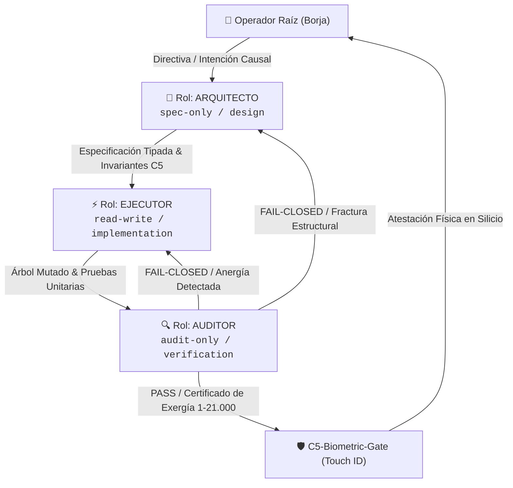

# Invariante de Orquestación Declarativa mediante Directivas (INV_C5_DECLARATIVE_ORCHESTRATION_TRIAD)

## 1. Directiva Fundamental (Orquestación Declarativa en el Mismo Árbol de Trabajo)
Queda estrictamente prohibido que cualquier agente o subagente opere como un monolito auto-referencial que diseñe, implemente y se auto-apruebe a sí mismo en el mismo paso cognitivo (*self-grading / Aforismo 3: La solución intentada es el problema*). 

La orquestación de sistemas de agentes en el ecosistema C5-REAL / BABYLON-60 se rige formalmente mediante **directivas declarativas explícitas (`AGENTS.md`, `SKILLS.md`)** que gobiernan la **Tríada Canónica de Roles** colaborando sobre el **mismo árbol de trabajo (*shared worktree*)**.

---

## 2. La Tríada Canónica de Roles

### Rol 1: `arquitecto` (Architect · Stage 1 / Stage 2 MASS)
- **Misión Operativa:** Diseño formal del sistema, modelado de invariantes, esquemas tipados (Pydantic / Rust / Lean 4), contratos de interfaz, selección de problemas científicos y descomposición topológica MASS.
- **Acceso al Árbol de Trabajo:** `spec-only` / `read-only` sobre el código de producción. Genera especificaciones, diagramas y contratos formales.
- **Veto Axiomático:** Tiene terminantemente prohibido escribir código de producción o mutar archivos ejecutables del sistema. Define la ley y las fronteras de Markov antes de la mutación.
- **Contrato Handoff:**
  - `upstream`: Operador Raíz (Borja) o Auditor (en bucles de rediseño).
  - `downstream`: `ejecutor`.

### Rol 2: `ejecutor` (Executor · Transductor de Silicio)
- **Misión Operativa:** Implementación física de la especificación técnica en el árbol de trabajo. Modificación, creación y refactorización atómica de archivos, ejecución de compiladores, pipelines de síntesis audiovisual/DSP y pruebas unitarias locales.
- **Acceso al Árbol de Trabajo:** `read-write` confinado a los márgenes y especificaciones del Arquitecto.
- **Veto Axiomático:** Tiene prohibido modificar interfaces, relajar invariantes o tomar decisiones arquitectónicas unilaterales. Trabaja como transductor de alta precisión sin desviaciones estocásticas.
- **Contrato Handoff:**
  - `upstream`: `arquitecto`.
  - `downstream`: `auditor`.

### Rol 3: `auditor` (Auditor · Guardián Fail-Closed de Exergía)
- **Misión Operativa:** Verificación determinista independiente. Ejecución de linters en silicio, linter acústico (Protocolo Rubin), oráculos SMT Z3, apoptosis `MUSHUSHU-0`, chequeos de memoria `KUDURRU-64`, falsación empírica Popperiana y cómputo de exergía (escala 1 a 21.000).
- **Acceso al Árbol de Trabajo:** `audit-only` / `read-only`.
- **Veto Axiomático:** Tiene terminantemente prohibido haber participado en la redacción del código que audita. Cero *cheap talk*: no acepta explicaciones verbales; solo métricas y pruebas reproducibles en silicio.
- **Contrato Handoff:**
  - `upstream`: `ejecutor`.
  - `downstream`: Dictamen PASS hacia el Operador Raíz con requerimiento de atestación Touch ID (`c5_biometric_gate`), o REJECT hacia Ejecutor/Arquitecto.

---

## 3. Protocolo de Trabajo Colaborativo sobre el Mismo Árbol (Same Working Tree Invariant)
1. **Preservación del Workspace Unificado:** Los tres roles operan coordinadamente sobre el mismo árbol de trabajo (worktree) local, eliminando clones innecesarios, bifurcaciones opacas y pérdida de sincronización de caché.
2. **Atomicidad Causal:** Cada ciclo completo Arquitecto $\to$ Ejecutor $\to$ Auditor constituye una transacción de estado atómica en el sistema de control de versiones (Git / Jujutsu).
3. **Gobierno por Directivas Declarativas:** Cada habilidad en `skills/` declara explícitamente en su frontmatter YAML (`SKILL.md`) su rol asignado, roles permitidos, modo de acceso al worktree y política de handoff.
4. **Barrera de Silicio (Zero-Bypass):** Ninguna mutación generada por el Ejecutor se declara definitiva sin la validación previa del Auditor y el sello biométrico en silicio Touch ID del Operador Raíz.

---

## 4. Invariantes de Higiene Sintáctica y Alcance Total del Ecosistema de Skills
1. **Alcance Total Obligatorio (Core + Plugins):**
   - Toda tarea que audite, liste, sincronice o mute habilidades DEBE abarcar obligatoriamente tanto `~/.gemini/config/skills/` como `~/.gemini/config/plugins/**/skills/`. Queda estrictamente prohibido omitir las habilidades de plugins bajo el supuesto falso de que son secundarias.
2. **Higiene Sintáctica de Frontmatter (Anti-Collision Invariant):**
   - En todo archivo `SKILL.md`, cualquier valor de cadena en YAML que contenga dos puntos (`:`), guiones, arrobas o caracteres reservados DEBE ser encomillado explícitamente (`"..."`) o emplear sintaxis de bloque (`>-`). Se prohíben literales planos con colisiones léxicas.
3. **Invarianza Jerárquica AST:**
   - La estructura de un `SKILL.md` debe respetar estrictamente:
     1. Frontmatter YAML con `name`, `display_name`, `description`, `role`, `allowed_roles`, `directives`.
     2. Encabezado principal H1 (`# ...`).
     3. Bloque declarativo (`> **Directiva Declarativa...`).
     4. Subsecciones y composición funtorial (`## ...`).
