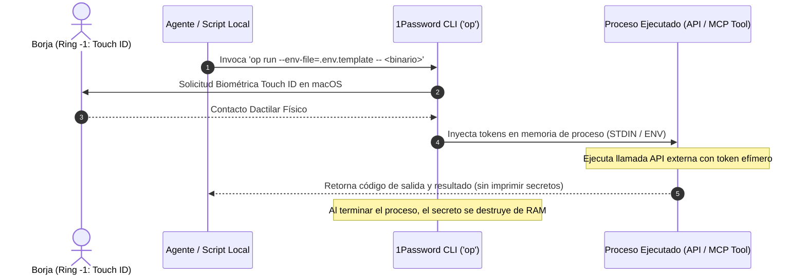

# C5 1Password Secrets: Inyección Segura de Credenciales en Silicio Local

> **Directiva Declarativa (Orquestación en Árbol de Trabajo):**
> - **Rol Asignado:** `ejecutor` (Ejecutor (Implementación en Silicio & Mutación de Árbol de Trabajo))
> - **Modo de Acceso a Worktree:** `read-write` (read-write (Mutación atómica de archivos, compilación, ejecución de tests locales y generación de artefactos))
> - **Fase Causal:** `implementation`
> - **Contrato Handoff:** Recibe de `arquitecto` $\to$ Despacha a `auditor`

> **Dominio:** BABYLON-60 (`00_ABZU_KERNEL / KudurruGate / Secrets`)  
> **Invariante Causal:** Cero secretos en texto plano. Queda terminantemente prohibido imprimir API keys o tokens en chats, logs o archivos no cifrados.  
> **Sustrato:** 1Password CLI (`op`) acoplado al Secure Enclave de Apple Silicon.

---

## 1. Misión Operativa
`c5-1password-secrets` implementa el estándar de **Cero Fuga Textual (*Zero Text Leakage*)**:
* Los agentes de IA nunca ven las claves en su ventana de contexto.
* Las credenciales se inyectan directamente en la memoria volátil del proceso hijo mediante el comando nativo `op run`.
* La autorización de acceso se delega al sensor biométrico **Touch ID** del MacBook Pro a través del daemon local de 1Password.

---

## 2. Flujo de Inyección en Memoria Efímera



---

## 3. Protocolo de Plantillas de Bóveda (`.env.template`)

En lugar de almacenar tokens reales en archivos `.env`, se definen referencias canónicas de 1Password:

```bash
# .env.template (Apto para control de versiones / Git)
STRIPE_SECRET_KEY="op://Sovereign-Vault/Stripe/secret_key"
OPENAI_API_KEY="op://Sovereign-Vault/OpenAI/api_key"
X_BEARER_TOKEN="op://Sovereign-Vault/X-Ads/bearer_token"
GITHUB_TOKEN="op://Sovereign-Vault/GitHub/personal_access_token"
```

### Ejecución Protegida:
```bash
op run --env-file=.env.template -- python script.py
```
* Las variables reales solo existen durante el ciclo de vida del subproceso.
* Si el script o agente intenta hacer un `echo $STRIPE_SECRET_KEY` o volcar el entorno, el valor queda enmascarado.

---

## 4. Invariantes de Seguridad para Agentes

1. **Prohibición de Impresión:** Prohibido emitir comandos `op item get --reveal` o similares que impriman contraseñas en `stdout`.
2. **Uso de Scopes Mínimos:** La bóveda compartida con los agentes (`Sovereign-Vault`) solo contiene tokens de trabajo acotados; las credenciales bancarias maestras o de identidad personal residen en bóvedas separadas inaccesibles para el CLI de desarrollo.
3. **Revocación en $O(1)$:** En caso de que un agente o subagente muestre comportamiento errático, Borja puede revocar la clave directamente desde la app de 1Password, anulando inmediatamente el acceso de todas las herramientas sin tener que editar configuraciones locales.
