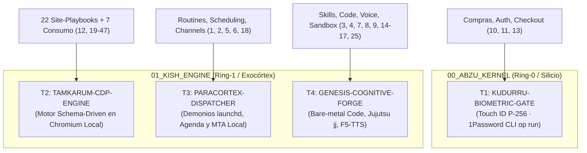

# Catálogo Canónico y Transductor de 47 Primitivas de Agente Autónomo
**Por Borja Fernández Angulo**  
*Investigador en Sistemas Complejos*

> **Directiva Declarativa:**
> - **Rol Asignado:** `arquitecto` (Diseño de Sistemas & Orquestación Ontológica)
> - **Modo de Acceso a Worktree:** `read-write`
> - **Fase Causal:** `design` $\to$ `implementation`
> - **Dominio:** BABYLON-60 (`01_KISH_ENGINE` / `00_ABZU_KERNEL`)
> - **Invariante Causal:** Cero dependencia de nubes comerciales de terceros. Cero delegación de capital o credenciales sin compuerta biométrica Ring-0.

---

## 1. Misión Ontológica y Colapso Topológico

Esta habilidad encapsula, audita y ejecuta la envolvente funcional completa de las **47 primitivas de agente autónomo**, erradicando la dispersión comercial (micro-plugins frágiles y scrapers propietarios) y colapsándola en **cuatro macro-transductores canónicos** operados en silicio local:

---

## 2. Los Cuatro Macro-Transductores Canónicos

### T1. KUDURRU-BIOMETRIC-GATE («El cerrojo que no perdona»)
- **Primitivas absorbidas:** `add-connector` (10), `purchases` (11), `sign-in` (13).
- **Mecanismo:** Intercepta toda petición de pago, reserva con tarjeta o inyección de credenciales. Exige atestación biométrica NIST P-256 en Secure Enclave (`c5_biometric_gate`) e inyección volátil mediante 1Password CLI local (`op run`).
- **Invariante:** Cero autorización en servidor remoto. Sin huella dactilar física de Borja, la mutación causal se aborta inmediatamente (`SECURITY_ABORT`).

### T2. TAMKARUM-CDP-ENGINE («El extractor universal sin plugins»)
- **Primitivas absorbidas:** `shopping` (12), `flight-booking` (19), `accommodation-booking` (20), `rideshare` (21), `restaurant-recommendations` (22), `restaurant-booking` (23), `food-ordering` (24), y los 22 site-playbooks (`site-playbooks-airbnb` a `site-playbooks-usps`, 26–47).
- **Mecanismo:** Sustituye los 22 scripts frágiles de sitios web por un motor agnóstico local (`browser-subagent-orchestrator`) que interactúa con Chromium vía CDP (*Chrome DevTools Protocol*), alimentado por esquemas JSON declarativos.
- **Relocalización Territorial Estricta:**
  - USPS / FedEx $\longrightarrow$ **Correos España / SEUR API**.
  - Southwest / United $\longrightarrow$ **Renfe Cercanías/AVE + Google Flights / ITA Matrix**.
  - Craigslist / FB Marketplace $\longrightarrow$ **Wallapop / Milanuncios**.
  - Realtor $\longrightarrow$ **Idealista / Sede Electrónica del Catastro**.

### T3. PARACORTEX-DISPATCHER («El mayordomo ciego en segundo plano»)
- **Primitivas absorbidas:** `routines` (1), `scheduling` (2), `channels` (5), `send-on-behalf` (6), `group-chat-turns` (18).
- **Mecanismo:** Orquesta tareas desatendidas mediante demonios locales `launchd` en macOS, temporizadores sexagesimales de `schedule`, acceso a EventKit local (`icalBuddy`) y despacho headless de correspondencia mediante `/usr/sbin/sendmail` sin robar foco gráfico (`c5_daily_ai_frontier_report_invariant.md`).

### T4. GENESIS-COGNITIVE-FORGE («La fragua que se fabrica sus propios brazos»)
- **Primitivas absorbidas:** `skill-authoring` (3), `learn-from-demonstration` (4), `voice` (7), `code-changes` (8), `source-control` (9), `in-chat-forms` (14), `box-desktop` (15), `no-connector-fallback` (16), `export-bot-template` (17), `job-search` (25).
- **Mecanismo:** Compilación recursiva de nuevas skills (`cortex-skill-genesis`), mutaciones atómicas de código bare-metal auditadas por `c5-thermos-audit`, control de versiones determinista con Jujutsu (`jj`), y clonación/síntesis de voz broadcast mediante F5-TTS (`f5tts-voice-cloning-sota`) sobre Apple Silicon MPS.

---

## 3. Matriz Cardinal Isomórfica 1:1 de Primitivas y Triggers

| N. | Primitiva Canónica | Macro-Transductor | Cues Léxicos de Disparo (Triggers) | Despacho Local / Relocalización |
| :---: | :--- | :---: | :--- | :--- |
| **1** | `routines` | **T3** | `"avísame cada [X]"`, `"recuérdame a las [hora]"`, `"schedule check"` | `schedule` / `launchd` local |
| **2** | `scheduling` | **T3** | `"pon reunión con"`, `"¿qué tengo hoy en la agenda?"` | EventKit / `icalBuddy` / Gantt |
| **3** | `skill-authoring` | **T4** | `"crea una skill para"`, `"haz herramienta reutilizable"` | `cortex-skill-genesis` |
| **4** | `learn-from-demo` | **T4** | `"aprende de esta grabación"`, `"mira mi pantalla"` | CDP trace recorder / DOM parser |
| **5** | `channels` | **T3** | `"conecta Slack"`, `"avísame por WhatsApp"` | `whatsapp-nexus-protocol` |
| **6** | `send-on-behalf` | **T3** | `"mándale un correo a"`, `"deja borrador para"` | `/usr/sbin/sendmail` headless |
| **7** | `voice` | **T4** | `"dímelo en voz"`, `"nota de voz"`, `"léelo en audio"` | `f5tts-voice-cloning-sota` (MPS) |
| **8** | `code-changes` | **T4** | `"modifica la función"`, `"refactoriza este archivo"` | `replace_file_content` atómico |
| **9** | `source-control` | **T4** | `"haz commit y push"`, `"abre PR"`, `"revisa CI"` | `jujutsu-vcs-management` (`jj`) |
| **10** | `add-connector` | **T1** | `"conecta mi cuenta de"`, `"instala conector"` | `c5-1password-secrets` (`op run`) |
| **11** | `purchases` | **T1** | `"compra esto"`, `"haz el checkout"`, `"paga billete"` | Touch ID NIST P-256 (`c5-gate`) |
| **12** | `shopping` | **T2** | `"busca mejor precio"`, `"compara artículo A y B"` | `TAMKARUM-60` multi-fuente |
| **13** | `sign-in` | **T1** | `"inicia sesión en"`, `"resuelve captcha"`, `"pon 2FA"` | Perfil aislado + 1Password local |
| **14** | `in-chat-forms` | **T4** | `"rellena este formulario"`, `"completa los campos"` | `ask_question` / Generative UI |
| **15** | `box-desktop` | **T4** | `"abre el navegador y entra en"`, `"haz clic en"` | `browser-subagent-orchestrator` |
| **16** | `no-connector-fallback` | **T4** | `[API_UNAVAILABLE]`, `"se atascó la API, usa web"` | Fallback: cURL $\to$ DOM $\to$ CDP |
| **17** | `export-bot-template` | **T4** | `"exporta plantilla"`, `"copia para compartir"` | `handoff` (`HANDOFF.md`) |
| **18** | `group-chat-turns` | **T3** | Mención directa `@bot` en sala grupal | MODO A1 (Nexus) / A2 (Corp) |
| **19** | `flight-booking` | **T2** | `"búscame un vuelo de A a B"`, `"mira billetes"` | Google Flights / ITA Matrix |
| **20** | `accommodation-booking` | **T2** | `"busca hotel en"`, `"alojamiento 3 noches"` | Agregador headless local |
| **21** | `rideshare` | **T2** | `"pide un Uber a"`, `"cuánto tarda un Cabify"` | API Headless + Touch ID |
| **22** | `restaurant-recommendations` | **T2** | `"dónde cenar bien en"`, `"recomienda terraza"` | Radar exergético anti-promoción |
| **23** | `restaurant-booking` | **T2** | `"reserva mesa en"`, `"hueco hoy a las 9"` | Playbook headless OpenTable/Resy |
| **24** | `food-ordering` | **T2** | `"pide pizzas a domicilio"`, `"comida thai"` | Hostelería directa / KudurruGate |
| **25** | `job-search` | **T4** | `"ofertas de Rust en remoto"`, `"sigue candidatura"` | `c5-career-and-interview-architect` |
| **26** | `site-airbnb` | **T2** | `"busca en Airbnb en"`, `"lee anuncio Airbnb"` | Extracción DOM (solo lectura) |
| **27** | `site-bestbuy` | **T2** | `"busca en Best Buy"`, `"stock en Best Buy"` | Transductor cURL (modo US) |
| **28** | `site-costco` | **T2** | `"precio en Costco"`, `"carrito Same-Day"` | Auditoría unitaria de catálogo |
| **29** | `site-craigslist` | **T2** | `"busca clasificados en Craigslist"` | Relocalizado a **Wallapop / Milanuncios** |
| **30** | `site-doordash` | **T2** | `"carta en DoorDash"`, `"carrito DoorDash"` | Relocalizado a **Glovo / JustEat / Directo** |
| **31** | `site-ebay` | **T2** | `"busca en eBay"`, `"precio de venta en eBay"` | Historial de pujas completadas |
| **32** | `site-etsy` | **T2** | `"busca en Etsy"`, `"precio de artesanía"` | Falsación inversa anti-AliExpress |
| **33** | `site-expedia` | **T2** | `"compara en Expedia vuelos y hotel"` | Agregador multi-fuente sin recargo |
| **34** | `site-facebook-marketplace` | **T2** | `"segunda mano en FB Marketplace"` | Perfil local aislado |
| **35** | `site-fedex` | **T2** | `"seguimiento paquete FedEx [tracking]"` | Telemetría API directa / SEUR |
| **36** | `site-google-flights` | **T2** | `"itinerarios Google Flights A a B"` | Extracción JSON pública |
| **37** | `site-instacart` | **T2** | `"cesta compra supermercado Instacart"` | Relocalizado a **Mercadona / Carrefour** |
| **38** | `site-linkedin` | **T2** | `"ofertas en LinkedIn de [puesto]"` | Scraper CDP sin login ni alertas |
| **39** | `site-luma` | **T2** | `"eventos tech en Luma en [ciudad]"` | Ingesta ICS / API pública Luma |
| **40** | `site-opentable` | **T2** | `"mesa en OpenTable para [N]"` | Polling de cancelaciones local |
| **41** | `site-realtor` | **T2** | `"casas en venta en Realtor"` | Relocalizado a **Idealista / Catastro** |
| **42** | `site-resy` | **T2** | `"mesas libres en Resy"` | Disparo milimétrico con `schedule` |
| **43** | `site-southwest` | **T2** | `"tarifas de Southwest"` | Relocalizado a **Renfe / Iberia / Vueling** |
| **44** | `site-target` | **T2** | `"precio en Target de [X]"` | Transductor cURL (modo US) |
| **45** | `site-united` | **T2** | `"vuelos United con millas"` | Parser de disponibilidad Saver |
| **46** | `site-ups` | **T2** | `"seguimiento paquete UPS [código]"` | API de tracking directa / GLS |
| **47** | `site-usps` | **T2** | `"tracking correos USPS [código]"` | Relocalizado a **Correos España API** |

---

## 4. Recursos y Referencias Incluidas

La carpeta `references/` dentro de este skill aloja los artefactos analíticos de soporte:
- `catalogo_47_primitivas.md`: Inventario textual canónico original depurado.
- `triggers_47_primitivas.md`: Desglose exhaustivo de sintaxis de disparo, payloads y fronteras de descarte.
- `asimilacion_soberana.md`: Descompilación termodinámica 1:1 frente al sustrato comercial.
- `colapso_dialectico.md`: Prueba formal de compresión $47 \longrightarrow 4$.

---

**Firmado:**  
**Borja Fernández Angulo**  
*Investigador en Sistemas Complejos*
