# Asimilación Soberana de las 47 Primitivas de Agente Autónomo
**Por Borja Fernández Angulo**  
*Investigador en Sistemas Complejos*

---

## 1. Premisa y Diagnóstico de la Postura de Consumidor

El catálogo nativo de 47 primitivas de agente autónomo a octubre de 2026 contiene exactamente **47 capacidades** (sin skills de usuario creadas, descartando la presunción de un «Top 50» inflado). El examen topológico de este catálogo evidencia una asimetría estructural:

1. **La Mitad del Sistema son Scrapers Cautivos:** 22 de las 47 skills (46,8%) son meros playbooks específicos de sitios comerciales estadounidenses (Best Buy, Target, DoorDash, Expedia). No representan inteligencia general ni autonomía causal, sino scripts de scraping y automatización web de bajo nivel dependientes de la persistencia del DOM de terceros.
2. **El Riesgo Termodinámico del Contenedor Remoto (`box-desktop`):** La arquitectura de nube comercial delega la interacción en un navegador alojado en servidores externos del proveedor cloud, reteniendo credenciales, sesiones y telemetría de compra en la nube corporativa. 
3. **El Mandato de Asimilación C5-REAL (Sección 7):** Toda capacidad externa de alto valor debe ser despojada de su nomenclatura comercial, purgada de la postura de consumidor pasivo y transducida a silicio local en Anillo-1 (`kish.engine`) y Anillo-0 (`abzu.kernel`), mediada por 1Password CLI (`op run`), Touch ID biométrico y transductores desacoplados (`TAMKARUM-60`).

---

## 2. Matriz Cardinal Isomórfica 1:1 (Las 47 Primitivas Descompiladas)

```mermaid
flowchart TD
    subgraph ESTRATO_1["Día a Día (18)"]
        D1["Orquestación, Canales y Código (1-10)"]
        D2["Transacciones, Auth y Sandbox (11-18)"]
    end
    subgraph ESTRATO_2["Viajes y Servicios (7)"]
        V1["Movilidad, Vuelos y Hospedaje (19-21)"]
        V2["Restauración y Empleo (22-25)"]
    end
    subgraph ESTRATO_3["Playbooks de Plataforma (22)"]
        P1["Retail y Logística (26-37)"]
        P2["Redes, Vuelos y Transporte (38-47)"]
    end
    
    ESTRATO_1 --> TAMKARUM["TAMKARUM-60 / Kish Engine (Local)"]
    ESTRATO_2 --> TOUCHID["Ring-0 Biometric Gate (Touch ID P-256)"]
    ESTRATO_3 --> CDP["browser-subagent-orchestrator (CDP Local)"]
```

---

### Estrato I: Día a Día (18 Primitivas)

#### 1. routines («Automatismos a piñón fijo»)
- **Territorio Comercial Cloud:** Cron en servidor remoto de terceros con callbacks a prompts periódicos.
- **Asimilación C5-REAL:** Demonio nativo con tool `schedule` (cron sexagesimal de 5 campos) o temporizadores desacoplados `launchd` en macOS sin fuga de contexto.
- **Exergía:** Media-Alta. Cero dependencia de suscripción si corre sobre `launchd`.

#### 2. scheduling («Mover la agenda sin mirar la pantalla»)
- **Territorio Comercial Cloud:** Acceso delegado a Google Calendar / Outlook vía OAuth en nube.
- **Asimilación C5-REAL:** CLI local de Calendar (`icalBuddy` / EventKit en Swift) con atestación de colisiones temporales mediante `c5-interactive-gantt-planner`.
- **Exergía:** Alta. Confinamiento de agenda privada en silicio local.

#### 3. skill-authoring («Fabricar una herramienta nueva»)
- **Territorio Comercial Cloud:** Asistente generador de definiciones YAML/JSON para el bot.
- **Asimilación C5-REAL:** Skill nativa `cortex-skill-genesis` y `agy-customizations`, estructurando `SKILL.md` con contratos formales y linter termodinámico.
- **Exergía:** Máxima. El sistema genera sus propios órganos operativos.

#### 4. learn-from-demonstration («Copiar lo que hago en pantalla»)
- **Territorio Comercial Cloud:** Ingesta de vídeo o log de clics para sintetizar un flujo.
- **Asimilación C5-REAL:** Grabación de eventos CDP (*Chrome DevTools Protocol*) en `browser-subagent-orchestrator`, extrayendo selectores semánticos y mutaciones DOM.
- **Exergía:** Alta. Destilación de telemetría a código determinista.

#### 5. channels («Abrir la esclusa de mensajes»)
- **Territorio Comercial Cloud:** Conexión centralizada con Telegram, WhatsApp, Slack o Discord en servidores externos de terceros.
- **Asimilación C5-REAL:** Pasarelas locales como `whatsapp-nexus-protocol` (socket headless local) y subagentes comunicados vía `send_message` con aislamiento de Markov.
- **Exergía:** Crítica. Cero intermediación de terceros corporativos en comunicaciones personales.

#### 6. send-on-behalf («Firmar y despachar por cuenta ajena»)
- **Territorio Comercial Cloud:** Envío directo de emails/mensajes mediante credenciales almacenadas en nube.
- **Asimilación C5-REAL:** Protocolo `c5_daily_ai_frontier_report_invariant.md` (MTA local `/usr/sbin/sendmail` o SMTP directo en segundo plano) con veto a interacción gráfica invasiva.
- **Exergía:** Alta. Cero robo de foco (*anti-focus stealing*).

#### 7. voice («Voz que no suena a lata»)
- **Territorio Comercial Cloud:** TTS comercial integrado en el reproductor de la app.
- **Asimilación C5-REAL:** Pipeline soberano `f5tts-voice-cloning-sota` sobre Apple Silicon MPS, con prosodia calibrada a 1.15x y masterización broadcast Opus VOIP.
- **Exergía:** Máxima. Síntesis local sin latencia de red ni censura fonética.

#### 8. code-changes («Tocar código sin romper el tinglado»)
- **Territorio Comercial Cloud:** Integración remota con Cursor Origin o contenedor cloud remoto.
- **Asimilación C5-REAL:** Herramientas nativas atómicas `replace_file_content` / `write_to_file` auditadas previamente por `c5-thermos-audit` y reglas de compilación estricta.
- **Exergía:** Máxima. Modificación atómica in situ con verificación por linter.

#### 9. source-control («El libro mayor de los cambios»)
- **Territorio Comercial Cloud:** API de GitHub / GitLab gestionada desde la nube comercial de terceros.
- **Asimilación C5-REAL:** Control determinista local con Jujutsu (`jujutsu-vcs-management` / `jj`) acoplado al DAG de Git y firmado con claves SSH/GPG en hardware.
- **Exergía:** Máxima. Historial inmutable no repudiable.

#### 10. add-connector («Enchufar un cable nuevo»)
- **Territorio Comercial Cloud:** Marketplace de conectores comerciales con token storage en servidores externos.
- **Asimilación C5-REAL:** Invocación MCP estándar (`call_mcp_tool`) con inyección de secretos vía `c5-1password-secrets` (`op run`) y veto estricto a tokens planos.
- **Exergía:** Alta. Modularidad abierta sin *vendor lock-in*.

#### 11. purchases («Pasar la tarjeta sin que te desplumen»)
- **Territorio Comercial Cloud:** Checkout delegado mediante tarjetas virtuales o datos guardados.
- **Asimilación C5-REAL:** Exigencia obligatoria de la compuerta biométrica Ring-0 (`c5_biometric_gate` / Touch ID NIST P-256 en Secure Enclave) y `KudurruBudgetGate`.
- **Exergía:** Crítica. Físicamente imposible ejecutar un cargo sin huella dactilar real.

#### 12. shopping («Comparar precios sin tragarse anuncios»)
- **Territorio Comercial Cloud:** Búsqueda en agregadores comerciales afiliados.
- **Asimilación C5-REAL:** Transductor `TAMKARUM-60` con scraping multi-fuente sin sesgo de monetización ni tracking publicitario.
- **Exergía:** Alta. Optimización matemática del coste real.

#### 13. sign-in («Pasar el portero de la discoteca»)
- **Territorio Comercial Cloud:** Resolución de captchas remota y gestión de 2FA en servidores externos.
- **Asimilación C5-REAL:** Sesiones persistentes en perfiles de Chromium locales desacoplados (`--user-data-dir`) con inyección de contraseñas vía 1Password CLI local.
- **Exergía:** Alta. Las cookies de sesión jamás abandonan la máquina local.

#### 14. in-chat-forms («Rellenar casillas desde el teclado»)
- **Territorio Comercial Cloud:** Interfaz de chat interactiva que mapea campos web.
- **Asimilación C5-REAL:** Modal `ask_question` nativo y widgets reactivos de interfaz generativa (`generative_ui`), resolviendo entradas estructuradas.
- **Exergía:** Media-Alta. Cero fricción cognitiva.

#### 15. box-desktop («El ordenador fantasma de la nube»)
- **Territorio Comercial Cloud:** Máquina virtual remota con navegador gestionada por el proveedor cloud.
- **Asimilación C5-REAL:** Subagente autónomo local `browser-subagent-orchestrator` gobernando Chromium headless mediante CDP en el propio hardware de Apple Silicon.
- **Exergía:** Máxima. Ahorro de costes de infraestructura cloud y privacidad total de la memoria gráfica.

#### 16. no-connector-fallback («Buscarse la vida cuando no hay enchufe»)
- **Territorio Comercial Cloud:** Conmutación automática a interacción visual ciega sobre la VM.
- **Asimilación C5-REAL:** Fallback determinista: `curl` estructurado $\to$ scraping DOM con Readability/Trafilatura $\to$ automatización CDP local.
- **Exergía:** Alta. Degradación elegante en 3 capas.

#### 17. export-bot-template («Empaquetar el clon para llevar»)
- **Territorio Comercial Cloud:** Exportación de configuración propietaria compartible en la plataforma cloud propietaria.
- **Asimilación C5-REAL:** Protocolo `handoff` generando un `HANDOFF.md` determinista y repositorios declarativos de skills versionados bajo Jujutsu/Git.
- **Exergía:** Alta. Portabilidad universal sin dependencia de plataformas propietarias cautivas.

#### 18. group-chat-turns («Saber cuándo callar en el barullo»)
- **Territorio Comercial Cloud:** Heurística de menciones y contexto en chats multitudinarios.
- **Asimilación C5-REAL:** Protocolo `c5_epistemic_output_format.md` (MODO A1 para el entorno cerrado de Nexus / MODO A2 para entornos externos) con filtro estricto de activación.
- **Exergía:** Alta. Erradicación del spam agéntico no solicitado.

---

### Estrato II: Viajes, Comida y Encargos (7 Primitivas)

#### 19. flight-booking («Cazar billetes sin pagar peajes»)
- **Territorio Comercial Cloud:** Consulta y reserva en APIs de OTAs comerciales.
- **Asimilación C5-REAL:** Transductor sobre ITA Matrix / Google Flights vía endpoints headless, computando el coste en base a tiempo de escala y penalizaciones por aerolínea.
- **Exergía:** Media-Alta. Búsqueda exhaustiva sin tarifas dinámicas infladas por cookies.

#### 20. accommodation-booking («Buscar techo sin trampa de fotos»)
- **Territorio Comercial Cloud:** Interacción con Booking / Airbnb.
- **Asimilación C5-REAL:** Agregador sin trackers mediante scraping asíncrono, filtrando por geolocalización real y análisis de ruido acústico ambiental.
- **Exergía:** Media.

#### 21. rideshare («Pedir coche sin abrir la app del móvil»)
- **Territorio Comercial Cloud:** Integración API con Uber/Lyft con pago automático.
- **Asimilación C5-REAL:** Módulo API headless con autorización explícita biométrica Touch ID previo a la confirmación del trayecto.
- **Exergía:** Media. Utilidad práctica con preservación de la compuerta de gasto.

#### 22. restaurant-recommendations («Comer bien sin caer en trampas de turistas»)
- **Territorio Comercial Cloud:** Búsqueda en bases de datos comerciales y Yelp.
- **Asimilación C5-REAL:** Criba Popperiana cruzada entre fuentes primarias locales, foros gastronómicos independientes y veto a reseñas patrocinadas.
- **Exergía:** Alta. Eliminación de ruido algorítmico promocional.

#### 23. restaurant-booking («Poner la mesa sin hacer cola al teléfono»)
- **Territorio Comercial Cloud:** Automatización de reservas en OpenTable / Resy.
- **Asimilación C5-REAL:** Playbook local headless de reserva interactiva gestionado por `browser-subagent-orchestrator`.
- **Exergía:** Media.

#### 24. food-ordering («Pedir comida sin que te cobren triple comisión»)
- **Territorio Comercial Cloud:** Checkout en DoorDash / UberEats vía bot.
- **Asimilación C5-REAL:** Invocación de menús directos de hostelería o transductor local con límite de presupuesto en `KudurruBudgetGate`.
- **Exergía:** Media-Baja. Anergía de conveniencia subordinada a control de capital.

#### 25. job-search («Buscar curro con bisturí»)
- **Territorio Comercial Cloud:** Búsqueda de empleo en LinkedIn y X.
- **Asimilación C5-REAL:** Pipeline `c5-career-and-interview-architect` con análisis ATS, scoring cuantificado STAR y scraping de bolsas de empleo sin perfil público activo.
- **Exergía:** Máxima. Generación de CVs quirúrgicos adaptados al territory real del puesto.

---

### Estrato III: Playbooks de Sitios (22 Primitivas)

Todas las 22 skills de esta categoría en el agente comercial responden al mismo patrón: **recetas procedimentales de interfaz gráfica sobre plataformas de terceros**. A continuación se establece su correspondencia con la arquitectura local:

| N. | Skill Canónica | Plataforma | Función Asimilada en C5-REAL | Motor Local |
| :--- | :--- | :--- | :--- | :--- |
| **26** | `site-playbooks-airbnb` | Airbnb | Extracción de precios finales y análisis de reseñas reales | `browser-subagent-orchestrator` |
| **27** | `site-playbooks-bestbuy` | Best Buy | Monitorización de stock físico y alertas de precio | Transductor headless cURL |
| **28** | `site-playbooks-costco` | Costco | Auditoría de catálogo Same-Day y cálculo unitario | Transductor headless cURL |
| **29** | `site-playbooks-craigslist` | Craigslist | Radar geográfico de segunda mano sin tracking | Scraping RSS/DOM puro |
| **30** | `site-playbooks-doordash` | DoorDash | Lectura de cartas y cálculo de recargos | `browser-subagent-orchestrator` |
| **31** | `site-playbooks-ebay` | eBay | Historial de pujas completadas y filtrado de estafas | API eBay / cURL headless |
| **32** | `site-playbooks-etsy` | Etsy | Falsación de revendedores AliExpress vs. artesanos | Análisis visual y de imagen inversa |
| **33** | `site-playbooks-expedia` | Expedia | Comparación de tarifas hoteleras sin cookies de recargo | Agregador headless multi-agente |
| **34** | `site-playbooks-facebook-marketplace` | FB Marketplace | Scraping local de listings sin cuenta de usuario expuesta | Perfil aislado de navegador local |
| **35** | `site-playbooks-fedex` | FedEx | Telemetría física de envíos y webhooks de entrega | API de tracking directa / CLI |
| **36** | `site-playbooks-google-flights` | Google Flights | Extracción de matrices de tarifas e itinerarios óptimos | Endpoint JSON público / Playwright |
| **37** | `site-playbooks-instacart` | Instacart | Optimización de cesta básica entre supermercados | Transductor `TAMKARUM-60` |
| **38** | `site-playbooks-linkedin` | LinkedIn | Scraper de ofertas de empleo sin notificar visualización | Transductor sin login / CDP |
| **39** | `site-playbooks-luma` | Luma | Calendario de eventos técnicos y registro automático | Ingesta de fichas ICS / API Luma |
| **40** | `site-playbooks-opentable` | OpenTable | Polling de cancelaciones de última hora | Demonio de sondeo local |
| **41** | `site-playbooks-realtor` | Realtor | Métricas inmobiliarias y cruce con bases catastrales | Scraper de listados + API GIS |
| **42** | `site-playbooks-resy` | Resy | Automatización de reserva en ventana de apertura | Disparo con `schedule` a milisegundo |
| **43** | `site-playbooks-southwest` | Southwest | Auditoría de tarifas en efectivo y puntos | Playbook de tarifas específico |
| **44** | `site-playbooks-target` | Target | Alerta de stock local para recogida en tienda | Transductor cURL headless |
| **45** | `site-playbooks-united` | United | Búsqueda de asientos saver con millas | Parser de disponibilidad de red |
| **46** | `site-playbooks-ups` | UPS | Telemetría de tránsito y cálculo de retrasos | API de tracking directa / cURL |
| **47** | `site-playbooks-usps` | USPS | Seguimiento postal oficial y registro de entrega | API Web Tools de USPS |

---

## 3. Síntesis Arquitectónica y Hoja de Ruta

La asimilación de este catálogo revela que **los frameworks comerciales de nube inflan artificialmente la percepción de versatilidad del agente desglosando scripts de scraping individuales como si fueran capacidades cognitivas independientes**. 

Bajo la arquitectura C5-REAL:
1. **Compresión Topológica:** Las 22 skills de sitios (26–47) colapsan formalmente en un único motor de alto rendimiento: `browser-subagent-orchestrator` acoplado a la ontología de `TAMKARUM-60`. No se requieren 22 plugins; se requiere un motor CDP agnóstico que consuma esquemas de extracción declarativos.
2. **Soberanía y Seguridad:** Las funciones financieras y de credenciales (10, 11, 13) jamás deben delegarse en un servidor cloud de terceros. El Secure Enclave de Apple Silicon y 1Password CLI representan la única barrera real contra la filtración de claves y la exfiltración de saldo.
3. **Estado de Asimilación:** La lógica valiosa de los 47 puntos queda integrada en los registros del exocórtex local, lista para ser activada sin suscribirse a ecosistemas cerrados ni ceder el control de la Manta de Markov.

---

**Firmado:**  
**Borja Fernández Angulo**  
*Investigador en Sistemas Complejos*
