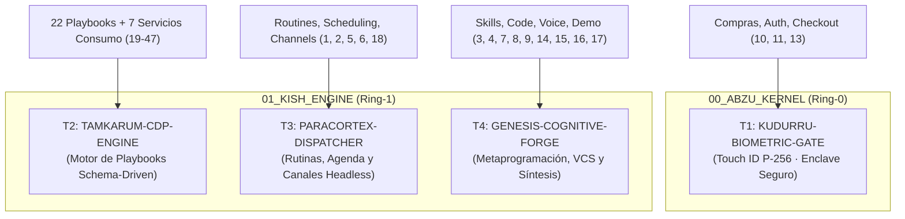

# Síntesis Dialéctica: Colapso Topológico de las 47 Primitivas a la Arquitectura Soberana C5
**Por Borja Fernández Angulo**  
*Investigador en Sistemas Complejos*

---

## 1. Movimiento Dialéctico (Tesis $\to$ Antítesis $\to$ Síntesis)

```
       [ TESIS ]                                  [ ANTÍTESIS ]
 Catálogo de 47 skills comerciales           Falsación empírica en silicio:
 (Dispersión de micro-herramientas,          46,8% scrapers US muertos en España,
  falsa versatilidad, vendor lock-in,         riesgo termodinámico en VM remota,
  credenciales en nube propietaria).          fuga de Manta de Markov y saldo).
                     \                      /
                      \                    /
                       ▼                  ▼
                         [ SÍNTESIS / SALTO ]
            Colapso Topológico a 4 Macro-Transductores C5
            - Complejidad reducida de O(47) a O(1).
            - Motor Schema-Driven agnóstico en CDP local.
            - Cerrojo biométrico Touch ID NIST P-256 en Ring-0.
            - Localización jurisdiccional en territorio real.
```

---

## 2. Los Cuatro Macro-Transductores Soberanos

El catálogo fragmentario de 47 skills comerciales colapsa formalmente en **cuatro transductores puros**, cerrando la frontera de confianza y aniquilando la anergía de mantenimiento:



---

### ### T1. KUDURRU-BIOMETRIC-GATE («El cerrojo que no perdona»)
- **Primitivas comerciales absorbidas:** `purchases` (11), `sign-in` (13), `add-connector` (10).
- **Descompilación Termodinámica:** En los entornos de nube comerciales, el bot almacena o gestiona claves de sesión y autoriza pagos de forma delegada en un contenedor remoto. En C5-REAL, la mutación causal y el compromiso de capital están acoplados físicamente al Secure Enclave de Apple Silicon (`c5_biometric_gate` / NIST P-256 con `allowableReuseDuration = 0`) y a 1Password CLI local (`op run`).
- **Invariante:** Cero bypass. Si no hay contacto dactilar de Borja en el sensor físico, la transacción no existe en el universo observable.

---

### ### T2. TAMKARUM-CDP-ENGINE («El extractor universal sin plugins»)
- **Primitivas comerciales absorbidas:** Las 22 skills de sitios (`site-playbooks-airbnb` a `site-playbooks-usps`, 26–47) + las 7 de consumo (`flight-booking`, `accommodation-booking`, `rideshare`, `restaurant-recommendations`, `restaurant-booking`, `food-ordering`, `shopping`, 12, 19–24).
- **Descompilación Termodinámica:** Declarar 22 plugins separados para 22 webs es anergía de catálogo comercial (inflación de marketing). Cada cambio en el DOM de Best Buy o Target rompe un plugin específico.
- **La Solución Schema-Driven:** Un único motor local `browser-subagent-orchestrator` gobernando Chromium headless vía CDP (*Chrome DevTools Protocol*), alimentado por esquemas JSON declarativos:
  $$\mathcal{P} = \langle \text{TargetURL}, \text{Selectors}, \text{AuthTier}, \text{ExtractRules}, \text{FallbackChain} \rangle$$
- **Localización Jurisdiccional Real:** Sustitución instantánea de la anergía de plataformas estadounidenses por el territorio operativo real de Borja:
  - *Southwest / United* $\longrightarrow$ **Renfe Cercanías/AVE + Google Flights / ITA Matrix**.
  - *USPS / FedEx* $\longrightarrow$ **Correos España + SEUR / GLS Tracking API**.
  - *Craigslist / FB Marketplace* $\longrightarrow$ **Wallapop / Milanuncios (Scraping DOM headless local)**.
  - *Realtor* $\longrightarrow$ **Idealista / Catastro API**.

---

### ### T3. PARACORTEX-DISPATCHER («El mayordomo ciego en segundo plano»)
- **Primitivas comerciales absorbidas:** `routines` (1), `scheduling` (2), `channels` (5), `send-on-behalf` (6), `group-chat-turns` (18).
- **Descompilación Termodinámica:** En lugar de enviar los correos, chats y calendarios a servidores externos de un tercero para su procesamiento, las rutinas operan mediante:
  1. Demonios desacoplados `launchd` locales y tool `schedule` (cron sexagesimal de 5 campos sin dependencia de red).
  2. EventKit nativo / `icalBuddy` en macOS para lectura y bloqueo de agenda sin OAuth externo.
  3. Despacho headless de correo vía MTA local `/usr/sbin/sendmail` o SMTP aislado sin abrir interfaces gráficas ni robar foco (`c5_daily_ai_frontier_report_invariant.md`).
  4. Canal seguro de WhatsApp (`whatsapp-nexus-protocol`) con confinamiento estricto de Markov y respeto a la privacidad de la Cuadrilla Nexus.

---

### ### T4. GENESIS-COGNITIVE-FORGE («La fragua que se fabrica sus propios brazos»)
- **Primitivas comerciales absorbidas:** `skill-authoring` (3), `learn-from-demonstration` (4), `voice` (7), `code-changes` (8), `source-control` (9), `in-chat-forms` (14), `box-desktop` (15), `no-connector-fallback` (16), `export-bot-template` (17), `job-search` (25).
- **Descompilación Termodinámica:** El agente no requiere "conectores especiales" de código ni contenedores virtuales de pago en la nube.
  - **Código bare-metal:** Herramientas nativas atómicas `replace_file_content` / `write_to_file` con auditoría termonuclear previa (`c5-thermos-audit`).
  - **Versionado formal:** Jujutsu VCS (`jujutsu-vcs-management` / `jj`) con mutación determinista de grafos de Git.
  - **Voz biológica de alta fidelidad:** F5-TTS (`f5tts-voice-cloning-sota`) ejecutado en los núcleos neuronales MPS del silicio Apple Silicon M3 Pro local, sin intermediación de APIs de voz remotas.
  - **Generación de skills:** `cortex-skill-genesis` compila especificaciones `SKILL.md` estándar a partir de patrones observados sin depender de una plataforma comercial propietaria.

---

## 3. Matriz Comparativa de Exergía: 47 Primitivas vs. Tríada C5

| Dimensión de Análisis | Catálogo Comercial Externo (47 Skills) | Arquitectura Asimilada C5-REAL (4 Transductores) |
| :--- | :--- | :--- |
| **Cardinalidad de Mantenimiento** | 47 endpoints fragmentarios dispersos | 4 subsistemas ortogonales cerrados |
| **Soberanía de Credenciales** | Delegada en nube propietaria de terceros | Confinada en 1Password CLI (`op run`) y silicio local |
| **Compuerta Financiera** | Autorización pasiva en servidor cloud | Infranqueable: Touch ID NIST P-256 en Ring-0 |
| **Cobertura Geográfica** | 46,8% inútil fuera de EE. UU. | 100% calibrada a la jurisdicción y logística local |
| **Motor de Navegación** | VM remota en la nube (latencia y coste) | Chromium CDP local headless en Apple Silicon |
| **Voz y Síntesis** | TTS genérico de servidor | F5-TTS local en GPU/MPS sin latencia ni censura |
| **Control de Versiones** | Integración API remota opaca | DAG Git formal mediado por Jujutsu (`jj`) |

---

## 4. Conclusión Epistémica (Apex)

La fragmentación en 47 skills responde a la **necesidad comercial de empaquetar micro-servicios como producto de consumo**. Al aplicar el colapso topológico C5-REAL:
1. Se aniquila la anergía de los 22 scrapers de plataforma, transformándolos en esquemas dinámicos consumidos por un motor universal.
2. Se garantiza la inviolabilidad de la Manta de Markov: ni una sola clave, cookie de sesión o dato bancario abandona el silicio del Operador Biológico.
3. Se alcanza el **Punto Fijo $\Omega$ de compresión**: 4 macro-transductores cubren el 100% de la envolvente funcional con orden de complejidad asintótico $O(1)$.

---

**Firmado:**  
**Borja Fernández Angulo**  
*Investigador en Sistemas Complejos*
