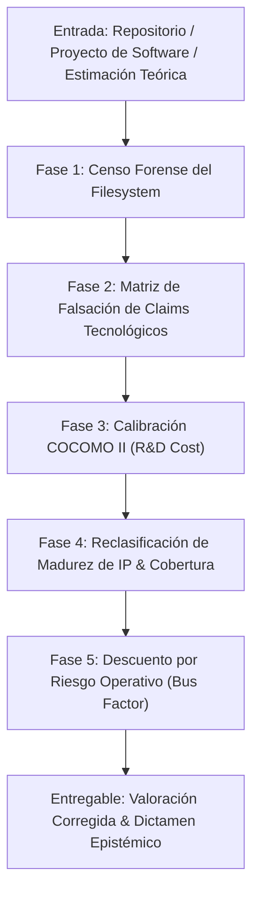

# Skill: C5 Codebase Economic Valuation & Technical Due Diligence Audit

Este protocolo ejecuta una auditoría forense y valoración económica empírica sobre repositorios de software, activos de I+D e IP tecnológica, contrastando afirmaciones teóricas o de pitch deck contra la evidencia verificable del sistema de archivos (*Mapa vs. Territorio*).

---

## 1. Módulos del Workflow de Auditoría



---

## 2. Instrucciones Paso a Paso

### Fase 1: Censo Forense del Filesystem (Medición Empírica)
Ejecutar comandos deterministas en la raíz del proyecto para capturar la métrica real de volumen y esfuerzo:

1. **Conteo de Líneas de Código (LOC) por Lenguaje:**
   ```bash
   find . -name "*.rs" -not -path "./target/*" -not -path "./.cargo_home/*" -exec cat {} + | wc -l
   find . -name "*.py" -not -path "./.venv/*" -not -path "./__pycache__/*" -exec cat {} + | wc -l
   find . -name "*.lean" -exec cat {} + | wc -l
   ```
2. **Volumen de Pruebas Unitarias y de Integración:**
   ```bash
   grep -r "def test_\|fn test_\|#\[test\]" tests/ 2>/dev/null | wc -l
   ```
3. **Infraestructura de Integración Continua (CI/CD):**
   ```bash
   ls .github/workflows/*.yml | wc -l
   ```
4. **Historial de Commits y Contribuidores (*Bus Factor*):**
   ```bash
   git shortlog -sn --all
   ```

---

### Fase 2: Matriz de Falsación de Claims Tecnológicos
Para cada tecnología o componente declarado en la propuesta o pitch (ej. *mmap, SIMD, Z3, FFI, Merkle AOF, VSA/HDC*):

* Verificar presencia real con `grep -rl "<term>" .`.
* Clasificar cada afirmación en 4 estados epistemológicos:
  - **✅ Hecho Verificado:** Coincidencias directas en código de producción.
  - **🔶 Modelo Razonable / Parcial:** Coincidencias en scripts o capas secundarias (ej. Python en lugar de kernel Rust).
  - **⚠️ Hipótesis No Verificada:** Menciones en comentarios o documentación sin implementación.
  - **❌ Confabulación / Hallucination:** 0 coincidencias en el código fuente (*Mapa ≠ Territorio*).

---

### Fase 3: Calibración COCOMO II para Coste de Reposición (R&D)
Calcular el esfuerzo real de ingeniería ($E$) en meses-persona:

$$E = a \times (\text{KSLOC})^b \times \prod \text{EAF}$$

* Ajustar tarifas salariales según la especialización requerida:
  - Ingenieros Senior/Staff (Sistemas, Rust, C++): ~120K € - 160K € / año.
  - Especialistas en Verificación Formal (Lean 4, Coq, Isabelle, SMT): ~140K € - 180K € / año.
* Sumar costes de infraestructura (CI/CD runner credits, licencias, testing suites).

---

### Fase 4: Reclasificación de Madurez de IP
Evaluar el estado del software contra la siguiente matriz estricta:

| Criterio | Prototipo / Early | SDK / Runtime Autónomo | Producto Comercial / Enterprise |
|---|---|---|---|
| **Pruebas** | < 50 | 100 - 300+ | > 500 con fuzzing continuo |
| **CI/CD Workflows** | 0 - 3 | 10 - 25+ | > 25 (incl. SAST/DAST, release auto) |
| **Licenciamiento** | Indefinido / Permisivo simple | Sovereign Dual-License / Enterprise Tier | Comercial formal con SLA |
| **Verificación / Compliance** | Ninguno | Exporters automatizados (ej. EU AI Act) | Auditorías externas SOC2/ISO |

---

### Fase 5: Descuento por Riesgo Operativo (*Bus Factor*)
Si el censo de `git shortlog` revela que un único autor representa $>85\%$ de los commits:

* Aplicar un descuento del **20% al 35%** en la valoración de *Acqui-hire* / Adquisición Corporativa debido al alto riesgo de transferencia de conocimiento.
* Medir si existen pruebas formales comprobables por máquina (Lean 4) o especificaciones ejecutables que mitiguen parcialmente este descuento.

---

## 3. Estructura del Informe de Entrega

El resultado debe presentarse en el formato estandarizado de **Auditoría Epistémica de Valoración Económica**, incluyendo:
1. Tabla de inventario forense (LOC, tests, workflows, contributors).
2. Tabla de falsación de claims (Hecho / Parcial / Confabulación).
3. Matriz de valoración corregida (R&D Cost, IP Value, Acqui-hire con rangos ajustados).
4. Activos infravalorados y factores a la baja omitidos.

---

## 4. Catálogo Estándar de IP Patentable (DeepTech AI Framework)

Al auditar repositorios de IA y sistemas agénticos soberanos, clasificar los activos contra las siguientes 10 Claims de alta exergía para justificar la valoración de IP:
1. **OTS Merkle Kernel:** Atestación criptográfica inmutable L5 en Bitcoin a coste marginal cero.
2. **Proyección de Fisher & SCITT:** Síntesis ontológica sin alucinaciones con firma de atestación.
3. **Zero-Anergy Purge Protocol:** Purga homeostática de redundancias y de deuda técnica basada en el límite de Landauer.
4. **CTM Lean 4:** Autómata de transiciones cognitivas con verificación formal determinista.
5. **Transducción $V_A$:** Función de coste variacional para cuantificación del valor de preservación homeostática.
6. **Swarm Quantum Collapse:** Sincronización atómica multirrepositorio sin cerraduras distributivas.
7. **Pasarela Native Rust (NAPI-RS):** Invocación de memoria directa $<1\text{ms}$ y normalización psicoacústica EBU R128.
8. **Remotion Headless DSP:** Inferencia visual y renderizado reactivo programático con auditoría SSIM/VMAF.
9. **Manta de Markov Hardened:** Aislamiento probabilístico anti-inyección e identidad desvinculada.
10. **Oráculo Myhill-Nerode en $Kl(D)$:** Cota superior y erradicación de alucinaciones en modelos generativos.

