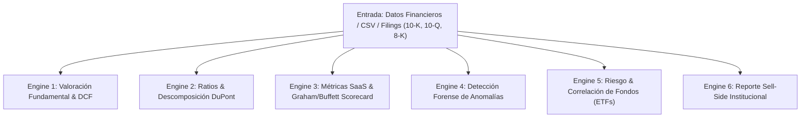

# Skill: C5 Institutional Equity Research & Quantitative Valuation Kernel

Este protocolo ejecuta análisis financiero, cuantitativo y de valoración de nivel institucional sobre empresas cotizadas (EE.UU., Hong Kong, A-Shares), startups SaaS, materias primas y fondos cotizados (ETFs).

---

## 1. Módulos de Análisis Cuantitativo

### 1.1. Engine 1 — Valoración por Flujos Descontados (DCF) & Sensibilidad
- **Flujos de Caja Libre (FCF):** Proyección a 5-10 años del $FCFF = EBIT \times (1 - t) + D\&A - \Delta NWC - CapEx$.
- **Tasa de Descuento (WACC):**
  $$WACC = \frac{E}{V} \cdot K_e + \frac{D}{V} \cdot K_d \cdot (1 - t)$$
  donde $K_e = R_f + \beta \cdot (R_m - R_f) + \text{Risk Premium}$.
- **Valor Terminal (TV):**
  $$\text{TV (Gordon Growth)} = \frac{FCF_n \times (1 + g)}{WACC - g} \quad \text{o Múltiplo de Salida (EV/EBITDA)}$$
- **Matriz de Sensibilidad:** Matriz bidimensional de Precio por Acción variando $WACC$ ($\pm 1.5\%$) vs. $g$ ($\pm 0.5\%$).

### 1.2. Engine 2 — Toolkit de Ratios Financieros & Descomposición DuPont
- **Rentabilidad:** ROE, ROIC, ROA, Margen Bruto, Margen Operativo, Margen Neto.
- **Liquidez & Solvencia:** Current Ratio, Quick Ratio, Net Debt/EBITDA, Interest Coverage Ratio ($EBIT / \text{Intereses}$).
- **Eficiencia Operativa:** Días de Inventario (DSO), Días de Cobro (DSO), Días de Pago (DPO), Cash Conversion Cycle ($CCC = DSO + DIO - DPO$).
- **Análisis DuPont de 5 Pasos:**
  $$ROE = \underbrace{\frac{EAT}{EBT}}_{\text{Carga Fiscal}} \times \underbrace{\frac{EBT}{EBIT}}_{\text{Carga Financiera}} \times \underbrace{\frac{EBIT}{Sales}}_{\text{Margen Operativo}} \times \underbrace{\frac{Sales}{Assets}}_{\text{Rotación Asset}} \times \underbrace{\frac{Assets}{Equity}}_{\text{Apalancamiento}}$$

### 1.3. Engine 3 — Scorecard Buffett/Graham & Métricas SaaS
- **Scorecard Graham/Buffett (0-100 Puntos):**
  - *Moat (25 pts):* Pricing power, barreras de entrada, retención de clientes.
  - *Management (25 pts):* Asignación de capital, ROIC histórico > 15%, recompras vs dilución.
  - *Financials (25 pts):* Apalancamiento controlado, FCF saludable, margen operativo sostenido.
  - *Valuation (25 pts):* Margin of Safety $> 25\%$, PE/PB relativo al sector.
- **Métricas SaaS / Subscripción:**
  - ARR (Annual Recurring Revenue), NRR (Net Retention Rate $> 110\%$), Gross Retention Rate.
  - LTV/CAC Ratio ($> 3.0x$), Payback Period ($< 12$ meses), Magic Number ($> 0.75$), Rule of 40 ($\text{Crecimiento ARR} + \text{Margen FCF} \ge 40\%$).

### 1.4. Engine 4 — Auditoría Forense & Detección de Anomalías Contables
- **Divergencia Flujo de Caja vs Beneficios:** Alerta si Beneficio Neto crece mientras $CFO$ (Cash Flow from Operations) cae.
- **Surge en Cuentas por Cobrar (AR):** Crecimiento desproporcionado de AR frente a Ventas (posible reconocimiento prematuro de ingresos).
- **Prueba de Benford:** Análisis de distribución del primer dígito significativo en estados financieros para detectar manipulación contable.
- **Capitalización de Gastos:** Rastreo de expansiones anómalas en CapEx inmaterial vs. OpEx.

### 1.5. Engine 5 — Comparativa de Fondos (ETFs) & Matriz de Correlación
- Procesa datos de NAV / Precios históricos desde CSV.
- **Rendimiento & Volatilidad:** Rendimiento Anualizado, Volatilidad ($\sigma$), Máximo Drawdown ($MDD$).
- **Métricas Corregidas por Riesgo:**
  - Sharpe Ratio: $(R_p - R_f) / \sigma_p$
  - Sortino Ratio: $(R_p - R_f) / \sigma_{\text{downside}}$
- **Matriz de Correlación de Activos:** Matriz de coeficientes de Pearson $r_{i,j}$ para optimización de cartera.

### 1.6. Engine 6 — Institutional Sell-Side & Cobertura Sectorial
- **Formatos Sell-Side:** Goldman Sachs / JPMorgan / Haitong International (Rating: Buy/Neutral/Sell, Target Price con metodología de valoración explícita).
- **Notas de Earnings (Resultados Trimestrales):** Análisis EPS surprise, desviaciones de Top-line, revisiones de Guidance y tabla de varianzas.
- **Outlook de Commodities:** Balances de Oferta/Demanda (S/D), curvas de costes de producción (Cost Curve), factores geopolíticos y previsión de precios.

---

## 2. Formatos de Entregable

1. **Concise Executive Tear Sheet (1-2 páginas):** Tesis de inversión (Bull/Bear), métricas clave, tabla de valoración rápida y veredicto del scorecard.
2. **Institutional Deep-Dive Research Report (10-25 páginas):** Informe completo con desglose por segmento, modelo DCF con sensibilidad, análisis DuPont, auditoría forense de balance y matriz de riesgos.
3. **VC Deal Memo / Letter (4-8 páginas):** Formato memo estratégico para comités de inversión y socios limitados (LPs).

