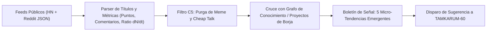

# C5 Overheard Radar: Sensor de Escucha Social y Detección de Tendencias

> **Directiva Declarativa (Orquestación en Árbol de Trabajo):**
> - **Rol Asignado:** `ejecutor` (Ejecutor (Implementación en Silicio & Mutación de Árbol de Trabajo))
> - **Modo de Acceso a Worktree:** `read-write` (read-write (Mutación atómica de archivos, compilación, ejecución de tests locales y generación de artefactos))
> - **Fase Causal:** `implementation`
> - **Contrato Handoff:** Recibe de `arquitecto` $\to$ Despacha a `auditor`

> **Dominio:** BABYLON-60 (`01_KISH_ENGINE / tamkarum.social_radar`)  
> **Invariante Causal:** Cero dependencia de suscripciones SaaS cloud. Extracción de alta velocidad sobre endpoints JSON públicos y abiertos.  
> **Origen:** Inspirado en el concepto `Overheard` de Lenny Rachitsky (Grok Bot).

---

## 1. Misión Operativa
`c5-overheard-radar` rastrea las conversaciones de trinchera técnica y cultural en la estepa digital (Reddit, Hacker News) para detectar:
1. **Puntos de Inflexión Cultural:** Problemas emergentes o quejas masivas sobre herramientas tecnológicas establecidas.
2. **Resonancia de Artefactos:** Detección de temas que coinciden con proyectos, ensayos o música del catálogo de Borja.
3. **Alimentación para TAMKARUM-60:** Identificación de términos y narrativas con alto momentum para orientar campañas de arbitraje y distribución.

---

## 2. Endpoints Públicos de Extracción (Coste Marginal Cero)

Para mantener la soberanía y evitar tokens de pago de APIs propietarias:
* **Hacker News (API Firebase Oficial Pública):**
  - Top Stories: `https://hacker-news.firebaseio.com/v0/topstories.json`
  - Item Detail: `https://hacker-news.firebaseio.com/v0/item/{id}.json`
* **Reddit (Endpoints JSON Nativos sin Autenticación):**
  - `https://www.reddit.com/r/{subreddit}/hot.json?limit=25`
  - Subreddits monitorizados por defecto: `r/technology`, `r/programming`, `r/MachineLearning`, `r/LocalLLaMA`, `r/singularity`, `r/cyberpunk`.

---

## 3. Rúbrica de Filtrado de Señal vs. Ruido



### Reglas de Poda:
* Se descartan posts puramente humorísticos, memes o notas de prensa corporativas (*cheap talk*).
* Se priorizan discusiones técnicas con alto ratio `comentarios / puntos` (indicador de fricción o debate no resuelto en el territorio).

---

## 4. Formato de Salida

El reporte del radar condensa la señal en 5 viñetas de alta densidad:

```markdown
### 📡 C5 Overheard Radar · Pulso de Tendencias

1. **[Tema / Fricción Detectada]:** [Resumen del debate en 1 línea].
   - **Fuente:** [HN / Reddit] (N puntos, M comentarios).
   - **Vínculo C5 / Oportunidad:** [Cómo se conecta con BABYLON-60, un ensayo o TAMKARUM-60].

2. ...
```
