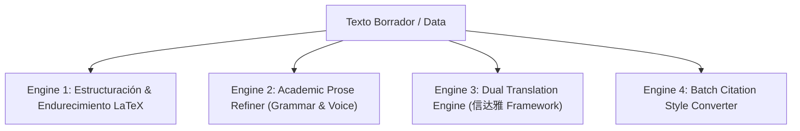

# Skill: C5 Scientific Paper & Scholarly Writing Architect

Este protocolo orquesta la generación, refinamiento prose-level, traducción bilingüe de alta fidelidad y maquetación de artículos científicos para conferencias y revistas de impacto mundial (CVPR, NeurIPS, ICML, ACL, IEEE/ACM Transactions).

---

## 1. Módulos de Redacción & Refinamiento

### 1.1. Engine 1 — Estructuración & Endurecimiento LaTeX
- **Abstract Canónico:** Contexto (1 frs) + Problema (1 frs) + Limitación previa (1 frs) + Contribución C5 (2 frs) + Resultado empírico clave (1 frs).
- **Notación Matemática Rigurosa ($\LaTeX$):** Formalización de tensores, operadores, variaciones ordinales y teoremas.
- **Compilación Limpia:** Detección de `overfull \hbox`, resolución de referencias cruzadas y plantillas oficiales (`neurips_2026.sty`, `cvpr.sty`, `icml2026.sty`).

### 1.2. Engine 2 — Academic Prose Refiner (Pulido Párrafo a Párrafo)
- **Voz & Claridad:** Transmutación de voz pasiva innecesaria a voz activa académica objetiva.
- **Estructura Argumentativa:** Eliminación de redundancias, conectores débiles ("It is worth noting that...") y adjetivos inflados.
- **Sugerencias de Revisión:** Presentación de versiones en formato diff comparativo (Original vs. Refinado).

### 1.3. Engine 3 — Dual Translation Engine (Faithfulness, Expressiveness, Elegance / 信达雅)
- **Faithfulness (信 - Fidelidad):** Preservación matemática y semántica exacta de términos técnicos y afirmaciones empíricas.
- **Expressiveness (达 - Fluidez):** Adaptación a las estructuras sintácticas nativas del inglés/chino académico sin traducciones literales torpes.
- **Elegance (雅 - Elegancia Estilística):** Elevación del registro lingüístico al estándar de publicaciones de primer nivel (Nature, Science, IEEE).

### 1.4. Engine 4 — Batch Citation Style Converter
- **Formatos Soportados:** BibTeX, APA 7th, MLA 9th, IEEE, Harvard, Chicago.
- **Validación Automatizada:** Comprobación de campos obligatorios (DOI, año, autores, volumen, páginas) y formato unificado en archivos `.bib`.

---

## 2. Salida Entregable

1. **Paquete de Código TeX:** Archivos `.tex`, `.bib` y scripts de compilación `tectonic` / `pdflatex`.
2. **Reporte de Refinamiento:** Comparativa de párrafos pulidos con justificación de cambios estilísticos.
3. **Catálogo de Citas Normalizado:** Archivo de referencias verificado y convertido al estilo objetivo.

