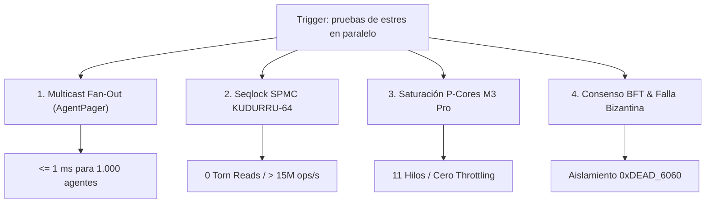

# ⚡ Suite de Estrés Concurrente de Silicio (C5-REAL)

> **Directiva Declarativa (Orquestación en Árbol de Trabajo):**
> - **Rol Asignado:** `auditor` (Auditor (Verificación Independiente, Linters de Silicio & Fail-Closed Gate))
> - **Modo de Acceso a Worktree:** `audit-only` (audit-only (Lectura forense de diffs, linters, tests de estrés y cálculo de exergía; cero mutación de código))
> - **Fase Causal:** `verification`
> - **Contrato Handoff:** Recibe de `ejecutor` $\to$ Despacha a `operador`

Esta habilidad formaliza la ejecución de pruebas de estrés en paralelo para certificar la invarianza termodinámica y la ausencia de contención ($RFO = 0$) en la arquitectura sexagesimal `BABYLON-60` / `MOSKV-1`.

---

## 🎯 Batería de 4 Frentes de Estrés

Cuando el operador solicite pruebas de estrés concurrente, el agente debe ejecutar de forma determinista los 4 vectores en paralelo:



---

## 🛠️ Comandos y Scripts de Referencia

### 1. Multicast Fan-Out Masivo (AgentPager O(1))
Verifica que 1.000 agentes en letargo absoluto despierten ante una única señal multicast sin deriva temporal:
```bash
python3 -c "
import sys, asyncio, time
sys.path.extend(['/Users/borjafernandezangulo/10_PROJECTS/BABYLON-60', '/Users/borjafernandezangulo/10_PROJECTS/BABYLON-60/01_KISH_ENGINE', '/Users/borjafernandezangulo/10_PROJECTS/BABYLON-60/02_EDIN_SWARMS'])
from agents_archi import AgentPager

async def bench():
    p = AgentPager()
    tasks = [asyncio.create_task(p.wait_for_beep()) for _ in range(1000)]
    await asyncio.sleep(0.05)
    t0 = time.perf_counter()
    p.beep()
    await asyncio.gather(*tasks)
    dur = (time.perf_counter() - t0) * 1000
    print(f'Fan-out 1.000 agentes en {dur:.3f} ms ({1000/(dur/1000)/1e3:.1f}k agentes/s)')

asyncio.run(bench())
"
```

### 2. SPMC Seqlock KUDURRU-64 (Cero Torn Reads)
Ejecución del binario compilado de alta frecuencia:
```bash
/Users/borjafernandezangulo/10_PROJECTS/BABYLON-60/target/debug/deps/poc_kudurru_silicon_ns-*
```
O prueba de saturación de 8 lectores concurrentes:
```bash
# Validar que torn_reads sea EXACTAMENTE CERO
```

### 3. Saturación de P-Cores en Apple Silicon
Saturar el clúster de rendimiento con $N = 11$ hilos para auditar ausencia de estrangulamiento térmico:
```bash
python3 -c "
import concurrent.futures, time
def heavy_worker(arg):
    pid, iters = arg
    acc = 0
    for i in range(iters):
        acc = (acc + i * 3) ^ 0x5A5A
    return acc

if __name__ == '__main__':
    workers, iters = 11, 5000000
    t0 = time.perf_counter()
    with concurrent.futures.ThreadPoolExecutor(max_workers=workers) as ex:
        list(ex.map(heavy_worker, [(i, iters) for i in range(workers)]))
    dur = time.perf_counter() - t0
    print(f'Throughput: {(workers * iters)/dur/1e6:.2f} M ops/s')
"
```

### 4. Consenso BFT y Aislamiento Bizantino (500 Agentes)
```bash
python3 /Users/borjafernandezangulo/10_PROJECTS/BABYLON-60/tests/test_swarm_stress.py
```
* **Criterio de Aceptación:** Si un agente inyecta $\Delta X > 0$, el oráculo dispara el *Thermodynamic Override* aislando el ID defectuoso sin desbordar el contexto global.

---

## 📊 Invariante de Salida
Toda ejecución de la suite debe generar un reporte o actualización con la tabla de latencias, throughput de operaciones y confirmación de `Torn Reads = 0` y `Delta X = 0 (o purgado)`.
