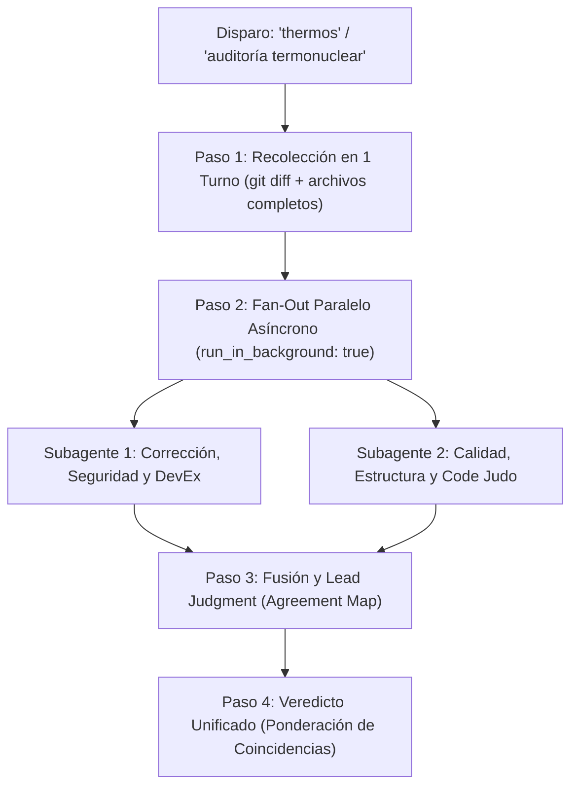

# C5 Thermos Audit: Auditoría Termonuclear de Ramas (Ring-1 / Ring-2)

> **Directiva Declarativa (Orquestación en Árbol de Trabajo):**
> - **Rol Asignado:** `auditor` (Auditor (Verificación Independiente, Linters de Silicio & Fail-Closed Gate))
> - **Modo de Acceso a Worktree:** `audit-only` (audit-only (Lectura forense de diffs, linters, tests de estrés y cálculo de exergía; cero mutación de código))
> - **Fase Causal:** `verification`
> - **Contrato Handoff:** Recibe de `ejecutor` $\to$ Despacha a `operador`

> **Dominio:** BABYLON-60 (`01_KISH_ENGINE / thermos.auditor`)  
> **Invariante Causal:** Cero complacencia generativa. El código añadido se somete a trituración implacable de seguridad y diseño antes de tocar la rama principal.

---

## 1. Misión Operativa
`c5-thermos-audit` ejecuta una revisión implacable dividida en dos vectores paralelos independientes:
1. **Vector Alpha (Corrección, Seguridad y DevEx):** Cazador de regresiones, roturas de entorno local (puertos, variables de entorno no documentadas), fugas de feature flags y vulnerabilidades reales en el diff.
2. **Vector Beta (Arquitectura, Calidad de Código y "Code Judo"):** Cazador de espagueti, indirecciones inútiles, violación de la **Regla de las 1.000 Líneas** y búsqueda activa de simplificaciones radicales (borrar código preservando el comportamiento).

---

## 2. Protocolo de Ejecución en 5 Pasos



### Paso 1: Recolección de Contexto en Un Solo Turno
Extraer atómicamente antes de invocar a los subagentes:
* El diff exacto contra la rama base (`git diff <base>...HEAD` o `git diff HEAD~1`).
* El contenido completo de los archivos que sufrieron modificaciones sustanciales para que los revisores no auditen a ciegas.

### Paso 2: Fan-Out Paralelo Simultáneo
Invocar a dos subagentes en el **mismo mensaje** con `run_in_background: true`:
* **Subagente 1 (`research` / Corrección y Seguridad):**
  - Rúbrica: Auditar exclusivamente el diff. Prohibido reportar fallos preexistentes fuera del cambio.
  - Vigilar si el PR rompe la capacidad de otro desarrollador para correr el repo en local (DevEx breaking).
  - Cero hallazgos con "investigación inconclusa": si el backend o las dependencias están en el repo, el agente DEBE leerlos antes de emitir una sospecha.
* **Subagente 2 (`research` / Calidad y Code Judo):**
  - **La Regla de las 1.000 Líneas (1k-Line Rule):** Si un archivo pasa de menos de 1k a más de 1k líneas, se marca como *bloqueante presuntivo* para forzar modularización.
  - **Code Judo:** Proponer activamente la eliminación de ramas enteras, modos o capas redundantes.
  - **Veto al Espagueti:** Prohibido añadir `if` ad-hoc en flujos existentes; deben abstraerse en máquinas de estados o tipos estrictos.

### Paso 3: Invariante de Ojos Frescos (*Fresh-Eyes*)
Los revisores auditan primero sin contaminarse con PRs o comentarios previos. Solo si encuentran problemas graves, contrastan con PRs o issues abiertos para deduplicar.

### Paso 4: Síntesis Unificada (*Lead Judgment*)
Al finalizar ambos subagentes:
1. Ponderar con máxima gravedad los hallazgos donde **ambos subagentes coinciden independientemente**.
2. Resolver discrepancias aplicando criterio de alta exergía (preferir simplicidad y robustez de tipos sobre elegancia retórica).
3. Clasificar los hallazgos en 4 cubos ontológicos:
   * **`[ACT ON]`**: Bloqueantes críticos de seguridad, regressions de DevEx o violaciones de la regla de 1.000 líneas.
   * **`[CONSIDER]`**: Simplificaciones de Code Judo o refactors recomendados.
   * **`[NOTED]`**: Deuda técnica menor observada.
   * **`[DISMISSED]`**: Falsos positivos o preocupaciones teóricas descartadas tras verificar el código circundante.

---

## 3. Formato de Salida en Chat

El reporte consolidado debe ser quirúrgico, sin prosa decorativa:

```markdown
### Veredicto Thermos: [APROBADO | REQUERIR CAMBIOS | BLOQUEADO]

#### Bloqueantes [ACT ON]
- `ruta/archivo.ext:L120`: [Descripción concisa del fallo o breaking DevEx].

#### Oportunidades Code Judo [CONSIDER]
- `ruta/archivo.ext`: [Reestructuración que elimina N líneas manteniendo el comportamiento].

#### Hallazgos Menores [NOTED]
- ...
```
