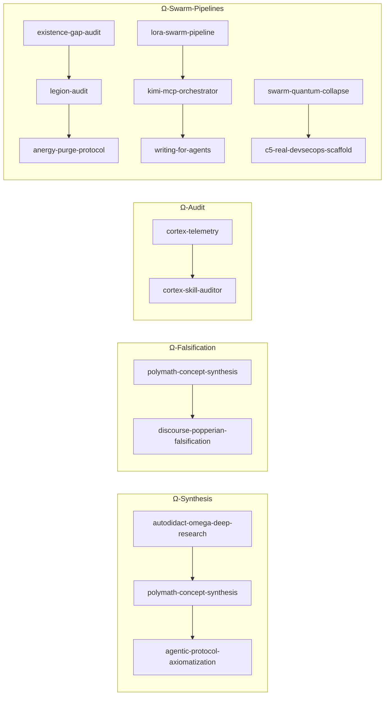

# Skill: Cortex Skill Composer (Composición Funtorial $F \circ G$)

Este protocolo permite componer múltiples habilidades en **cadenas de procesamiento funtorial**, garantizando que el output de cada fase se transforme sin pérdida de exergía hacia la siguiente.

---

## 1. Cadenas Canónicas Pre-definidas

Cuando el operador solicita un flujo complejo, el orquestador DEBE seleccionar o instanciar una de las siguientes cadenas canónicas:

### 1.1. Cadena Ω-Synthesis (Cristalización Ontológica Completa)
- **Secuencia**: `autodidact-omega-deep-research` $\to$ `polymath-concept-synthesis` $\to$ `agentic-protocol-axiomatization`
- **Uso**: Investigación profunda desde cero, proyectada a través de disciplinas y axiomatizada formalmente.

### 1.2. Cadena Ω-Falsification (Síntesis + Falsación Inmediata)
- **Secuencia**: `polymath-concept-synthesis` $\to$ `discourse-popperian-falsification`
- **Uso**: Formular un concepto en 6 disciplinas e inmediatamente someterlo a prueba popperiana de contraejemplos.

### 1.3. Cadena Ω-Legal (Análisis LegalTech + Falsación Epistémica)
- **Secuencia**: `c5-real-legaltech-analysis` $\to$ `discourse-popperian-falsification`
- **Uso**: Auditar plataformas o leyes, identificando anergía normativa y buscando falsación empírica.

### 1.4. Cadena Ω-Audit (Telemetría + Meta-Auditoría de Skills)
- **Secuencia**: `cortex-telemetry` $\to$ `cortex-skill-auditor`
- **Uso**: Extraer métricas de uso históricas y auditar la eficiencia exergética de las habilidades utilizadas.

### 1.5. Cadenas Ω-Swarm (Enjambres Multicapa C5-REAL)
- **Ω-Swarm-Audit**: `existence-gap-audit` $\to$ `legion-audit` $\to$ `anergy-purge-protocol` (Auditoría de existencia $\to$ enjambre de 100 workers $\to$ purga de anergía).
- **Ω-Swarm-Mining**: `lora-swarm-pipeline` $\to$ `kimi-mcp-orchestrator` $\to$ `writing-for-agents` (Minería N-Zonas $\to$ orquestación Kimi K3 $\to$ síntesis para agentes).
- **Ω-Swarm-Sync**: `swarm-quantum-collapse` $\to$ `c5-real-devsecops-scaffold` (Colapso cuántico git P×S $\to$ verificación DevSecOps Zero-Trust).

### 1.5. Cadena Ω-Genesis (Telemetría + Síntesis Predictiva)
- **Secuencia**: `cortex-telemetry` $\to$ `cortex-skill-genesis`
- **Uso**: Analizar patrones de prompts no cubiertos y sintetizar automáticamente nuevos `SKILL.md`.

---

## 2. Protocolo de Ejecución Funtorial

1. **Analizar la Demanda**: Determinar la lista ordenada de habilidades $[S_1, S_2, \dots, S_n]$.
2. **Heredar Invariantes de KERNEL**: Garantizar que la salida de $S_i$ cumple con los axiomas en [KERNEL.md](file:///Users/borjafernandezangulo/.gemini/config/skills/KERNEL.md).
3. **Mapeo de Salida-Entrada**: El artefacto o respuesta resultante de $S_i$ actúa como objeto de la categoría origen para $S_{i+1}$.
4. **Verificación de Cierre**: Emitir una síntesis final notificando los eslabones ejecutados y el delta de exergía logrado.
