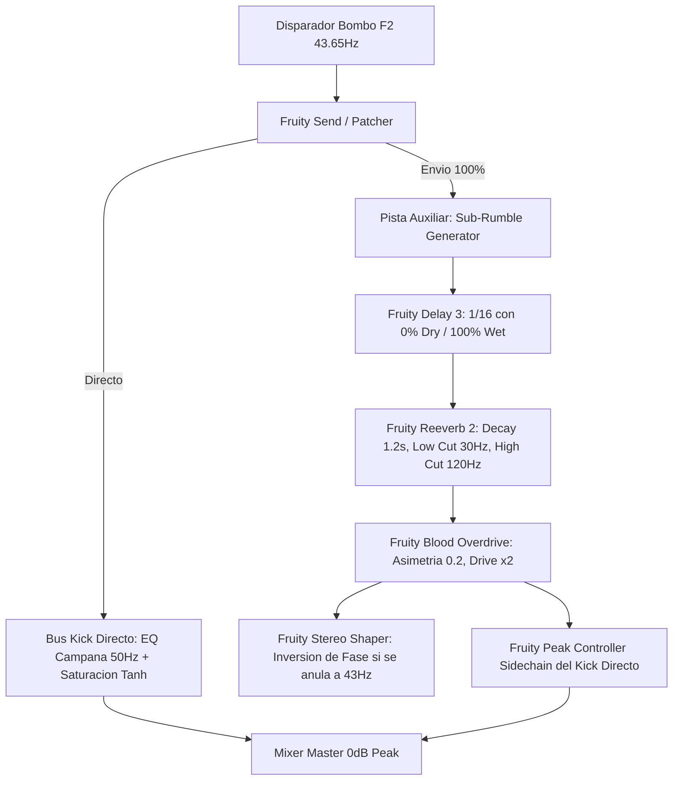

# FL Studio 2025 DSP Formulas, Sound Design & Mixer Architectures (C5-REAL)

Este documento condensa los modelos matemáticos, ecuaciones de transferencia y arquitecturas de ruteo de mezcla para FL Studio 2025 bajo criterios de alta exergía y conservación de fase.

---

## 🧮 1. Ecuaciones para Fruity Formula Controller

El plugin nativo **Fruity Formula Controller** permite modular cualquier parámetro de FL Studio mediante fórmulas matemáticas en tiempo real ($SongTime \in [0, \infty)$, variables $a, b, c \in [0, 1]$).

### A. LFO Orgánico Multirítmico (Interferencia Aperiodica)
Evita la monotonía de los LFOs sinusoidales simples mediante la superposición de dos frecuencias inarmónicas:
```text
0.5 + 0.3 * Sin(SongTime * 6.28318 * a) + 0.2 * Cos(SongTime * 6.28318 * b * 1.618033)
```
* **Variables:** $a$ controla la frecuencia fundamental; $b$ modula el armónico áureo ($\phi \approx 1.618$).
* **Aplicación:** Modulación de corte de filtro (*Cutoff*) en pads y arpegios atmosféricos.

### B. Saturador No Lineal Hiperbólico ($\tanh$)
Aproximación analógica de saturación de cinta y distorsión de válvulas para buses de mezcla:
```text
(Exp(2 * a * b) - 1) / (Exp(2 * a * b) + 1)
```
* **Variables:** $a$ es la señal entrante; $b$ es la ganancia de entrada (*Drive* de 1 a 5).

### C. Mapeo Caótico (Ecuación Logística de May)
Generador de caos determinista con atractores fractales:
```text
3.99 * a * (1 - a)
```
* **Aplicación:** Micro-jitter estocástico en parámetros de reverberación, modulación de desafinación (*detune*) y paneo pseudo-aleatorio.

### D. Envolvente Exponencial de Sidechain Inverso
Curva de atenuación matemática más limpia y musical que la compresión tradicional:
```text
1 - (Exp(-SongTime * 8 * a) * b)
```

---

## 🎚️ 2. Arquitectura de Mezcla: Melodic Techno Kick + Sub-Rumble

La clave del bombo de Maceo Plex, Tale of Us y Stephan Bodzin radica en el desacoplamiento de fase entre el transitorio del bombo y el lecho sub-grave (*rumble*):



### Reglas de Calibración de Fase:
1. **Mono Puro por debajo de $120\,\text{Hz}$:** En el mezclador, colocar el control de separación estéreo de la pista de bombo y de la pista de sub-rumble al $100\%$ a la derecha (Merged/Mono).
2. **Corte Quirúrgico:** Aplicar filtro paso-alto de fase lineal a $28\,\text{Hz}$ (corte de infrasonidos residuales) y corte paso-bajo en el rumble a $110\,\text{Hz}$ para dejar espacio libre a la pegada (*punch*) del bombo entre $80$ y $180\,\text{Hz}$.

---

## 🎧 3. Matriz de Audio Espacial y Apertura Estéreo Mid-Side

Para evitar el desfase destructivo (*comb-filtering*) al colapsar a mono:
1. En **Patcher**, dividir la señal con **Fruity Stereo Shaper** en componentes $Mid = (L + R) / \sqrt{2}$ y $Side = (L - R) / \sqrt{2}$.
2. Aplicar ecualización sustractiva en el canal $Side$ con un filtro paso-alto a $250\,\text{Hz}$. Todo el contenido inferior a $250\,\text{Hz}$ debe mantenerse en el centro $Mid$.
3. Insertar micro-delay de Haas (máximo $8$ a $14\,\text{ms}$) únicamente en el componente $Side$, garantizando compatibilidad mono absoluta.

---

## 💾 4. Centralización Soberana de Activos

Todo renderizado de audio, exportación de stems o grabación de canal master generado mediante este protocolo debe registrarse en el archivo raíz:
`~/Music/FL Studio Bounces/`
