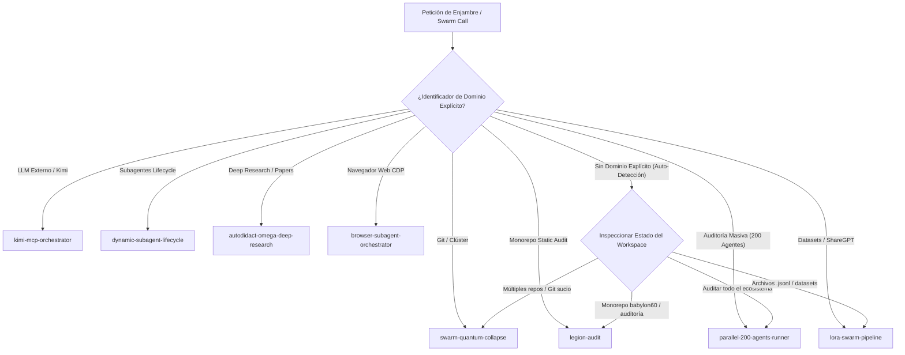

# 🐝 Swarm Router: Enrutador Maestro y Despachador C5-REAL

Este protocolo actúa como la puerta de entrada unificada para la orquestación, gestión y auto-detección de cualquier llamada a enjambres de subagentes dentro del ecosistema Antigravity / BABYLON-60.

---

## 🎯 Protocolo de Auto-Detección y Despacho Contextual

Ante una solicitud genérica de enjambre (ej. *"mejora los enjmabres"*, *"ejecutar enjambre"*, *"lanzar swarm"*), el router evalúa el estado del espacio de trabajo en tiempo de ejecución para determinar el motor de enjambre óptimo:

---

## 📐 Reglas de Oro de Orquestación

1. **Cero Fricción Discursiva (F=0):**
   No preguntar confirmaciones redundantes al operador. Si la tarea está clara o se puede inferir del contexto de archivos abiertos, disparar el enjambre correspondiente inmediatamente.

2. **Acotación Empírica P×S (Anti-Thrashing):**
   - macOS ARM64 (Apple Silicon): $P \in [2, 11]$, $S \in [1, 20]$.
   - Mínimo de context switches involuntarios (`ru_nivcsw` $\approx 2.132$ a $P=4, S=1$).

3. **Invariante de Cero Redundancia de I/O:**
   Carga única en RAM (`readlines()`) para pasadas N-Zonas, garantizando disipación termodinámica $I/O = 0$.
